# Часть 65

ТУТОРИАЛ ДЛЯ ЗАДАНИЯ NICO ДЛЯ EKOPARTY 2018 - ЧАСТЬ 1

Давайте отреверсим шаг за шагом задание **NICO** для **EKOPARTY** **2018**. Это сервер скомпилированный **64**-битным компилятором и работающий конечно на **WINDOWS**.

Для начала я посмотрю на него в **WINDOWS** 7. В любом случае, часть статического реверсинга будет похожей.

При запуске мы видим следующее.

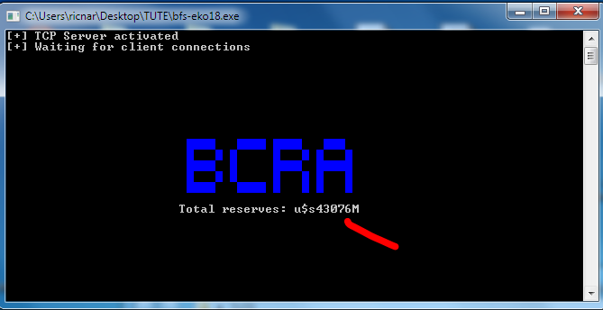

Описание находится здесь.

[https://labs.bluefrostsecurity.de/blog/2018/09/11/bfs-ekoparty-2018-exploitation-challenge/](https://labs.bluefrostsecurity.de/blog/2018/09/11/bfs-ekoparty-2018-exploitation-challenge/)

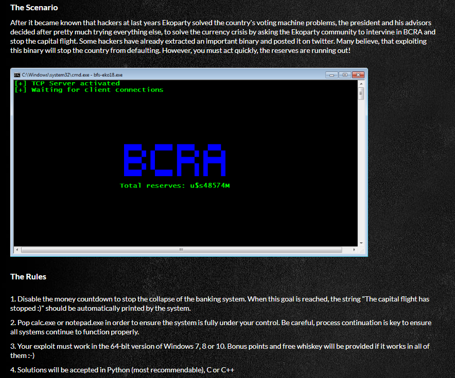

Резервные запасы уменьшаются и вы должны остановить это, затем, в качестве второй цели, вы должны запустить калькулятор. Мы открываем исполняемый файл в **IDA64**, чтобы проанализировать его.

В окне строк мы ищем **TOTAL** **RESERVES** и получаем два результата.

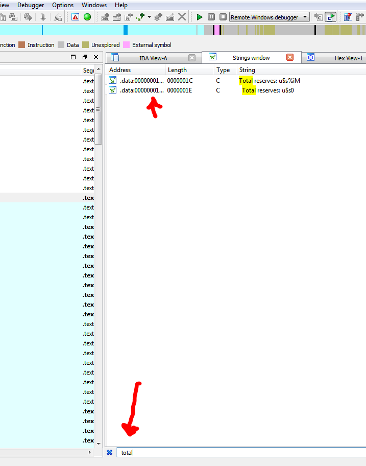

Давайте посмотрим, где они используются.

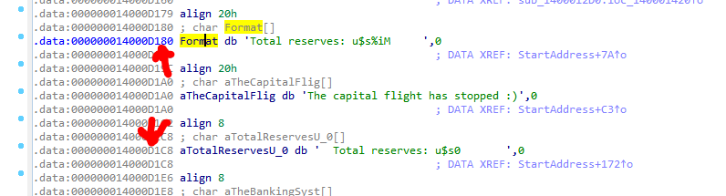

И нажав клавишу **X** мы можем увидеть ссылки.

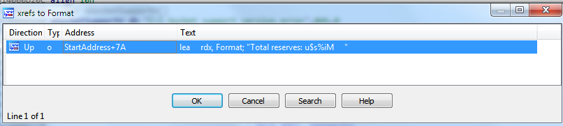

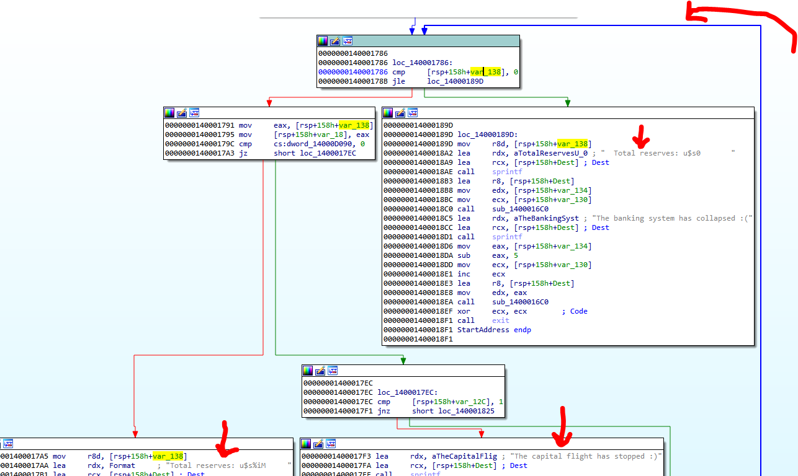

Здесь мы видим цикл со счетчиком. Когда он достигает нуля, программа переходит к **TOTAL RESERVES : U$0**, а если он больше нуля, программа переходит налево, чтобы вывести сумму, иначе программа идет туда, где находится строка **THE CAPITAL FLIGHT HAS STOPPED.**

Здесь мы видим десятичное значение **50000**, которым инициализируется переменная **CONTADOR\_GUITA**.

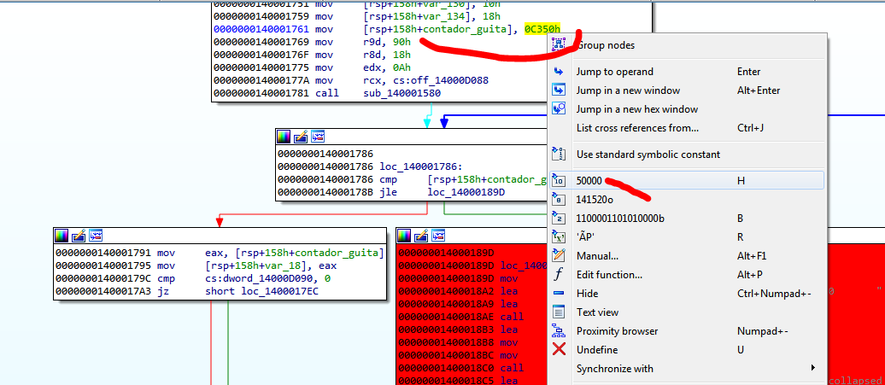

Здесь программа копирует переменную **CONTADOR\_GUITA** в другую переменную**.**

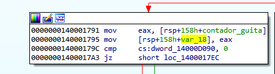

Я переименую её.

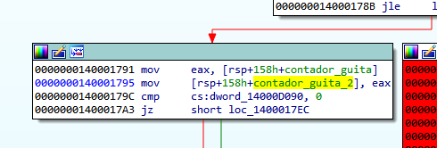

Мы видим также, что после функций **SPRINTF**, которые создают строку для печати в памяти, программа переходит к **CALL**, который наверняка будет тем вызовом, который печатает строку.

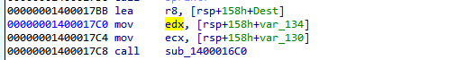

Есть две переменные **130** и **134**, которые передаются в качестве аргумента, и третья переменная, которая передается через регистр **R8**, которая является указателем на строку, которую я создал для печати.

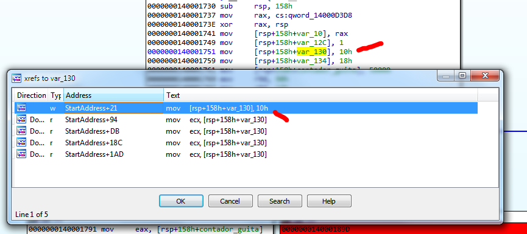

Здесь мы видим начало функции и как переменная инициализируется константой **0x10** и остальные строки читают переменную, значение больше не изменяется внутри функции.

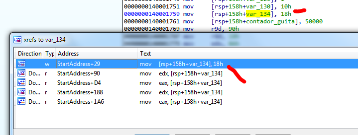

С переменной **134** происходит то же самое, поэтому мы переименуем сейчас их в **CONST\_0x10** и **CONST\_0x18**.

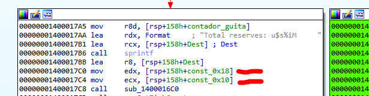

В **64х** битных приложениях, если мы хотим, чтобы имена аргументов распространялись в родительскую функцию, мы должны установить тип с помощью **SET** **TYPE** в адресе функции.

Делаем правый щелчок и выбираем **SET** **TYPE** или клавишу **Y.** Мы можем определить функцию как **USERCALL**, так как вызов **FASTCALL** позволяет нам только устанавливать регистры в качестве аргументов функции.

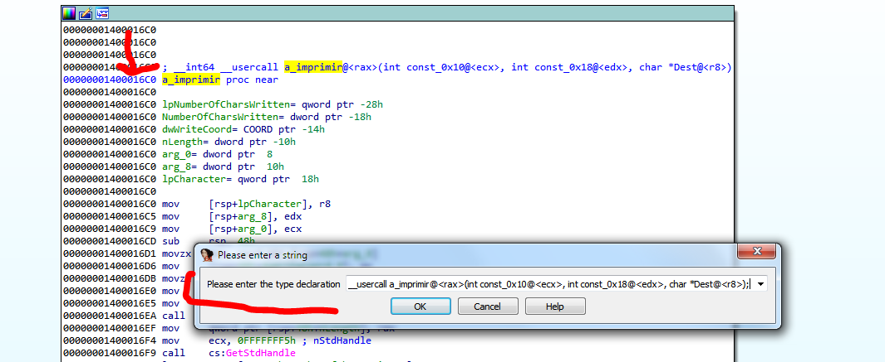

**\_\_INT64 \_\_USERCALL A\_IMPRIMIR@&lt;RAX&gt;\(INT CONST\_0X10@&lt;ECX&gt;, INT CONST\_0X18@&lt;EDX&gt;, CHAR \*DEST@&lt;R8&gt;\);**

Мы видим, что программа изменила функцию, которая была **\_\_FASTCALL** на **USERCALL**. Тип возвращаемого значения, я оставляю равным **\_\_INT64**. Я добавляю после нового имени **A\_IMPRIMIR @&lt;EAX&gt;**, что является регистром, в которой будет возвращать возвращаемое значение. Оно должно быть равно **@&lt;RAX&gt;**, но я уже сделал это, и это не влияет на анализ, так как программа не возвращает полезные значения только для печати, а затем три аргумента:

**INT CONST\_0X10@&lt;ECX&gt;
INT CONST\_0X18@&lt;EDX&gt;
CHAR \*DEST@&lt;R8&gt;**

Два целых числа и указатель на строку **DEST**.

Если в родительской функции все в порядке, должны появиться имена аргументов.

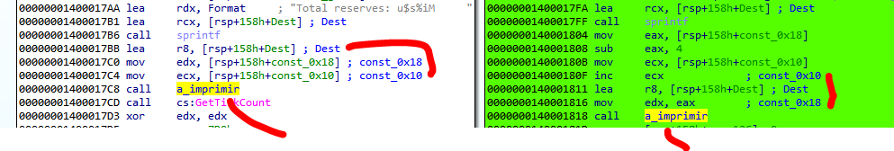

Мы видим, что в некоторых вызовах функции **A\_IMPRIMIR** программа добавляет к постоянным переменным **0x10** и **0x18** значения перед вызовом, как в случае зеленого блока, который увеличивает регистр **ECX** и вычитает **4** из регистра **EAX** перед вызовом. Также, пока не станет ясно, что это значение мы не будем его переименовывать.

Мы также видим, что резервирование пространства для локальных переменных выполняется с помощью инструкции **SUB** **RSP**, **48.**

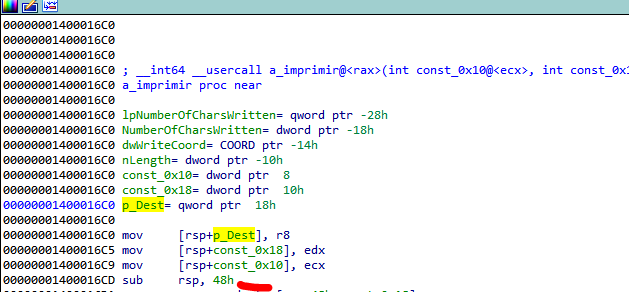

Программа сохраняет в стеке значения аргументов через регистры **ECX**, **EDX** и **R8** в пространство, зарезервированное для родительской функцией, поверх ее локальных переменных. Я резервирую еще **4** **QWORDS** для передачи аргументов, и, поскольку они находятся ниже адреса возврата, они ведут себя как если аргументы были бы переданы через стек.

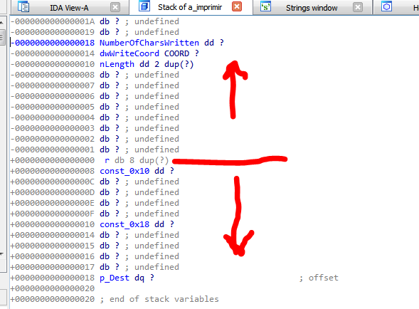

Здесь есть адрес возврата. Ниже как всегда находятся аргументы, а выше переменные. Все пространство под адресом возврата, где я сохраняю аргументы, было зарезервировано родительской функцией через её инструкцию **SUB** **RSP**, **XXX** Для этого я добавил больше места, чем нужно для локальных переменных.

Если мы добавим опцию указателя стека.

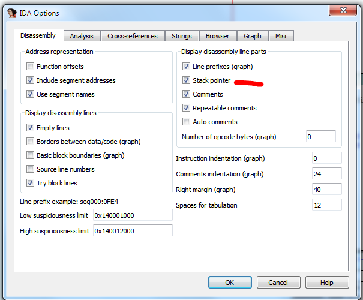

Мы видим, что стек не изменяется. Нет ни **PUSHа** ни **POPа**, и вход и выход из функции не были изменены.

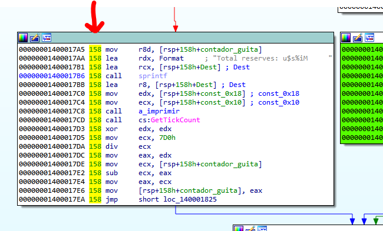

Мы видим, что это функции, относящиеся к **RSP**, не сохраняется регистр **RBP** в любое время, и все отсчитывается относительно **RSP** + **XXX** вместо **RBP** + **XXX**.

Мы видим, что щелкнув правой кнопкой мыши по одному из этих трех аргументов, который расположен ниже адреса возврата, мы подтверждаем, что это **RSP**+**18h**. \(они находятся ниже адреса возврата\).

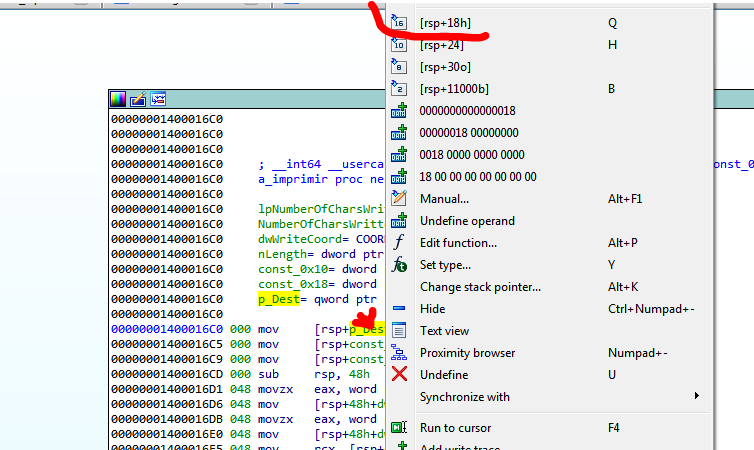

Таким образом, отсюда это похоже на известную функцию. Аргументы ниже **R** и переменные выше. Регистр **RBP** не сохраняется, потому что это всё относительно **RSP**.

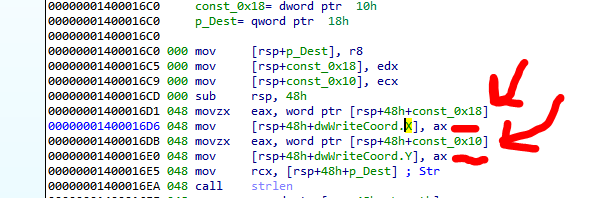

Мы видим, что аргументы **CONST**\_**0x10** и **0x18** являются частью структуры, которую обнаружила **IDA**.

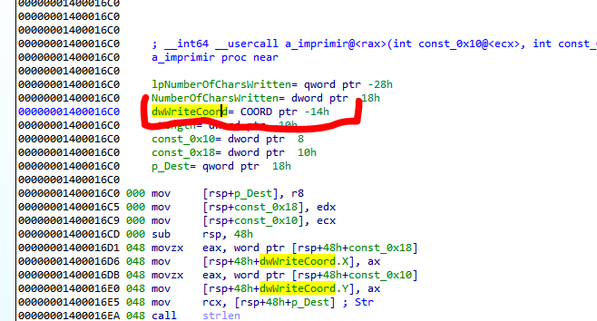

Структура имеет тип **COORD**, а переменная этого типа называется **DWWRITECOORD**.

В статическом представлении стека.
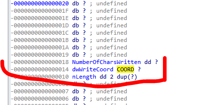

Мы можем дважды щелкнуть на **COORD.** Это приведет нас к определению.

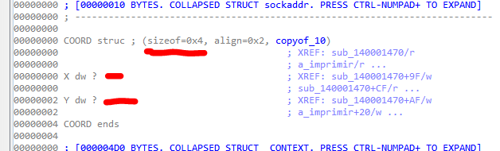

Размер структуры равен **4** байта, и у неё есть два поля: **WORD** **X** и **Y**.

И в **LOCAL** **TYPES** также есть определение.

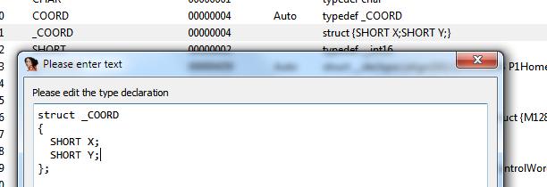

Т.е. теперь мы можем правильно переименовать аргументы.

Теперь смотрится красивее.

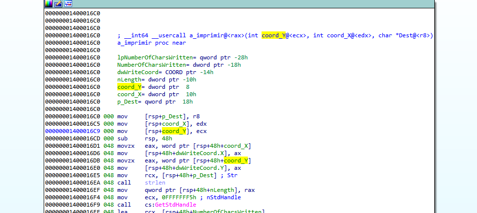

Мы знаем, что это не будет важной частью упражнения, но мы собираемся сделать всё это подробно.

Затем передаётся указатель на строку в функцию **STRLEN**, чтобы найти ее длину и сохранить ее в **NLENGTH**.

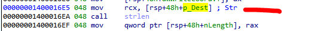

Затем вызывается функция **GETSTDHANDLE**, чтобы получить дескриптор стандартного устройства, которое может быть одним из трех в списке. \(-**10**, -**11** или -**12** в зависимости от того, является ли оно вводом, выводом или ошибкой\)

Также в **IDA** при правом щелчке и выборе пункта - **USE** **STANDARD** **SYMBOLIC** **CONSTANT** показывает в возможном списке значения, поэтому мы выбрали его оттуда.

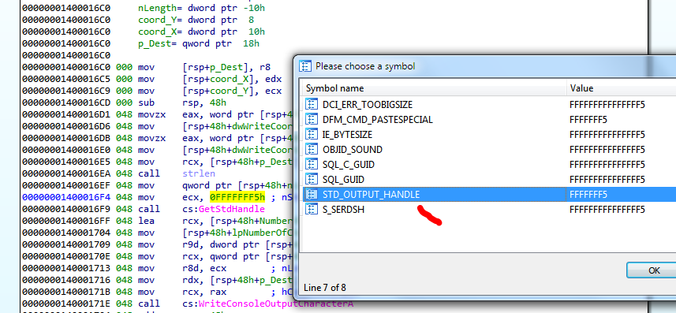

В регистре **RAX** программа возвращает дескриптор **HCONSOLEOUTPUT.**

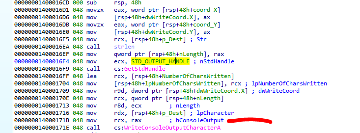

Это первый аргумент функции **WRITECONSOLEOUTPUTCHARACTER.** Справка поясняет, что функция копирует символы из буфера в выходные данные консоли.

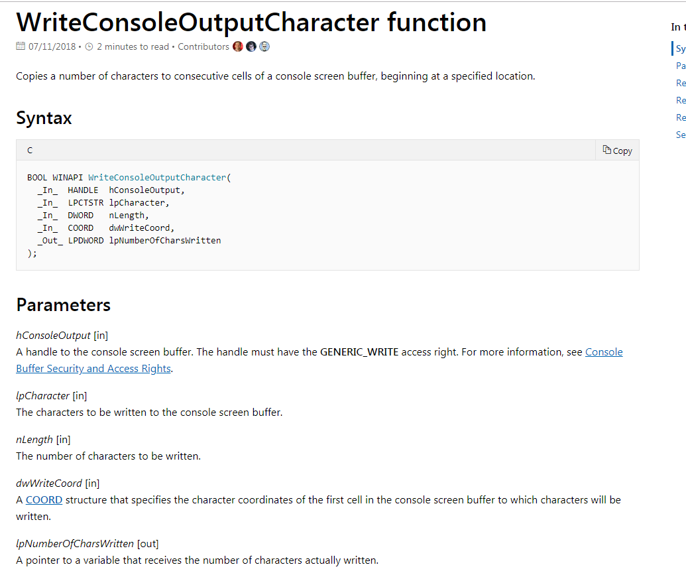

Как мы уже видели, первый аргумент передается через регистр **RCX** и является дескриптором **HCONSOLEOUTPUT**.

Второй находится в регистре **RDX** и является указателем на буфер для печати.

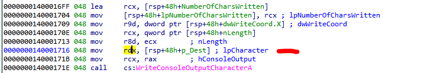

Третий через регистр **R8D** - это количество символов для печати **NLENGTH**.

Четвертый аргумент это структура **COORD**. Здесь программа показывает, что это поле **X**, но поскольку оно является первым полем, оно совпадает с началом того же поля, и при чтении **DWORD** читает **4** байта одного и того же поля, т.е. оба поля.

И последний аргумент передается стеком, поскольку он является пятым и является указателем на переменную, которая получит количество напечатанных байтов.

После выхода программа восстанавливает стек, который создала инструкция **SUB** **RSP**, **0x48** в начале. Теперь программа возвращает его в ноль с помощью инструкции **ADD** **RSP**, **0x48**.

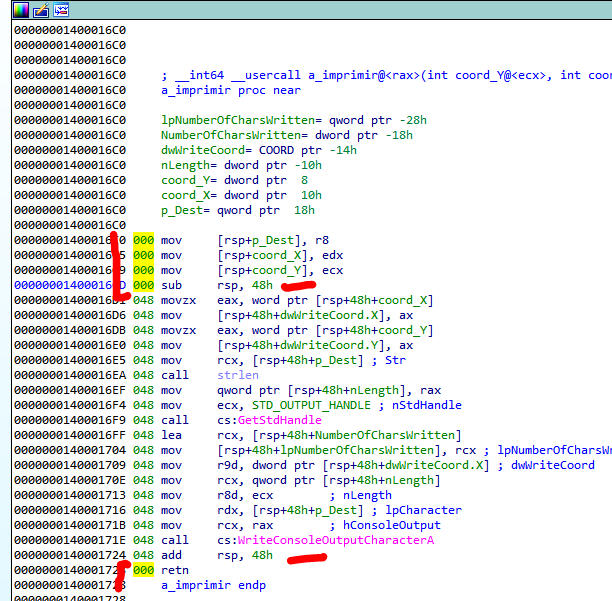

Хорошо. Эта функция уже завершена. Мы видим, что то, что вы добавляете в некоторых вызовах переменных **X** и **Y** начальных значений **0x10** и **0x18**, - это запись в другую позицию.

Возвращаясь к основной функции, мы видим, что есть глобальная переменная, которая, если мы наведем курсор мыши, мы увидим, что она инициализирована **1.** Если бы она была равна нулю, программа перенесла бы нас в зеленые блоки, где она не уменьшит значение счетчика, и выведет **THE CAPITAL FLIGHT HAS STOPPED.**

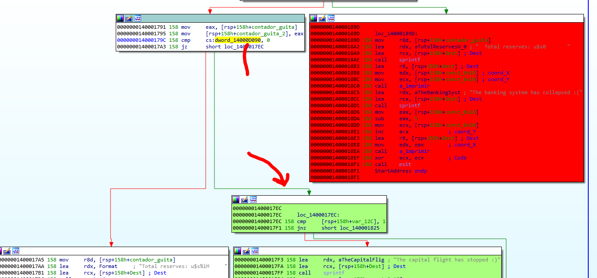

Существует значение **1**, которое изначально имеет глобальная переменную.

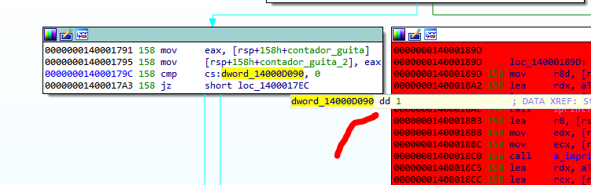

Мы переименуем переменную в **FLAG\_FUGA**, потому что, если она равна **1** т.е. если она истинна, то запасы уменьшаются, а если она равна нулю, то запасы восстанавливаются.

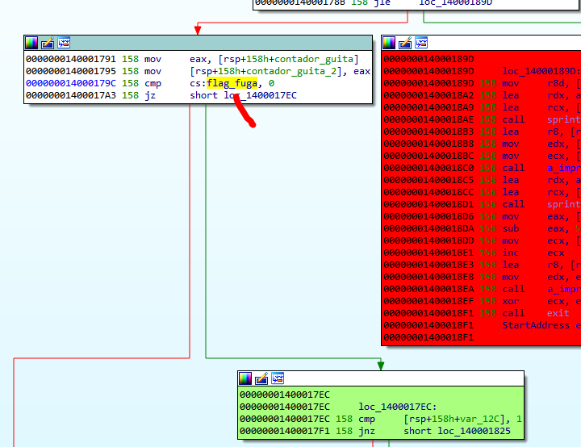

Мы также видим, что, если мы нажимаем **X** в указанной глобальной переменной, нет никакой ссылки на **LEGAL**, где она должна быть установлена в ноль. Проблема состоит в том, чтобы увидеть, как это сделать.

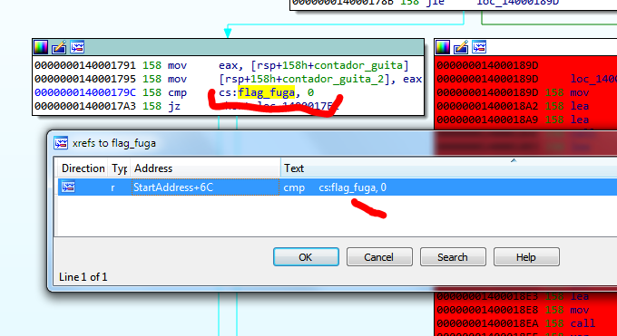

Здесь мы видим, что переменная находится в секции данных, что делает её доступным для записи, и мы увидим, как это сделать.

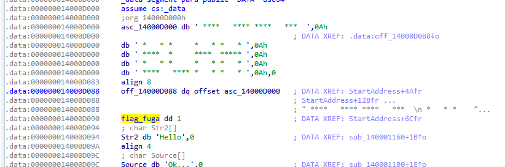

А сейчас давайте реверсить функцию **STARTADDRESS**. Мы видим, что она не использует аргументы, так как первое, что она делает, это **SUB** **RSP**, **158**. Мы помним, что если у нее есть аргументы, она сохраняет их в стеке, прежде чем резервировать место для переменных.

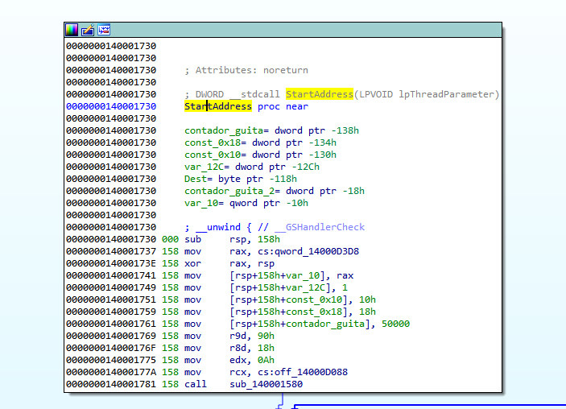

Также, если мы нажимаем **X** на имени, чтобы увидеть ссылки.

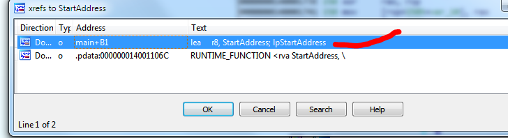

Мы видим, что это поток, созданный в основной функции. Мы закончим его полный анализ до этой функции **STARTADDRESS**, а затем продолжим здесь.

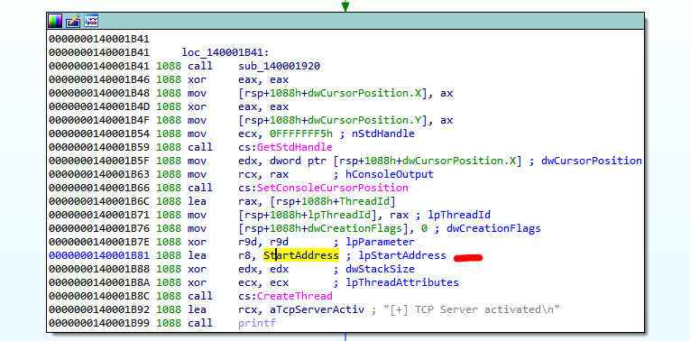

Затем есть переменная, которая, сохраняется здесь. Я называю ее **CONST\_1**, также переименуем **CONST\_0x10** и **0x18** в имя **COORD\_X** и **Y.**

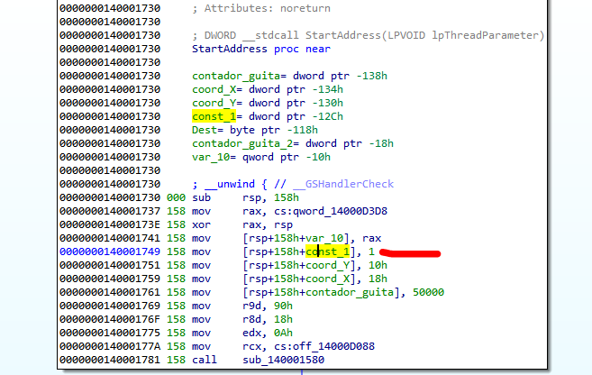

Мы видим, что эта переменная **CONST\_1** lo que hace es que una vez que ya se detuvo запасы уменьшаются так как это цикл, который будет продолжать исполняться, измениться на нуль и не будет бесконечно повторять печать **THE CAPITAL FLIGTH HAS STOPPED.**

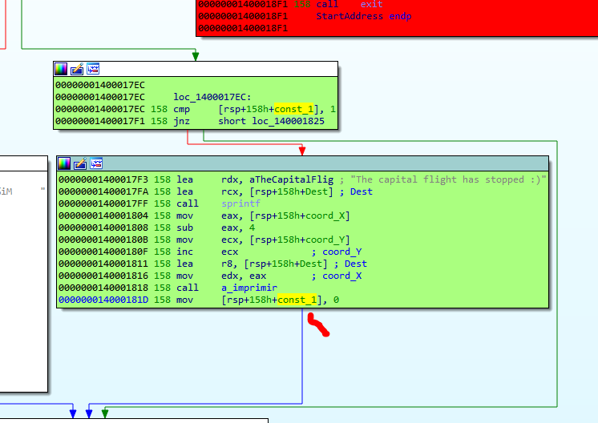

Таким образом, мы можем изменить имя на **FLAG\_IMPRIMIR\_STOP**.

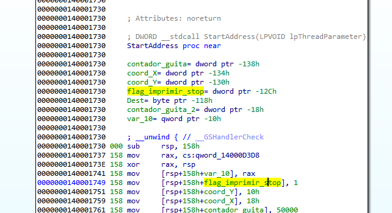

Мы помним что в **IDA** есть префиксы**.**

[https://www.hex-rays.com/products/ida/support/idadoc/609.shtml](https://www.hex-rays.com/products/ida/support/idadoc/609.shtml)

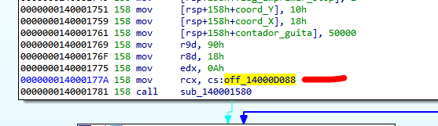

Эти префиксы, за которыми следуют подчеркивание \(как **OFF\_**\) и затем адрес, эквивалентны скобкам **\[\]**, а **OFF** указывает мне тип значения который находится в скобках.

Это было бы эквивалентно.

**MOV** **RCX**, \[**0x14000D088**\]

За исключением того, что программа добавляет, что содержимым является смещение.

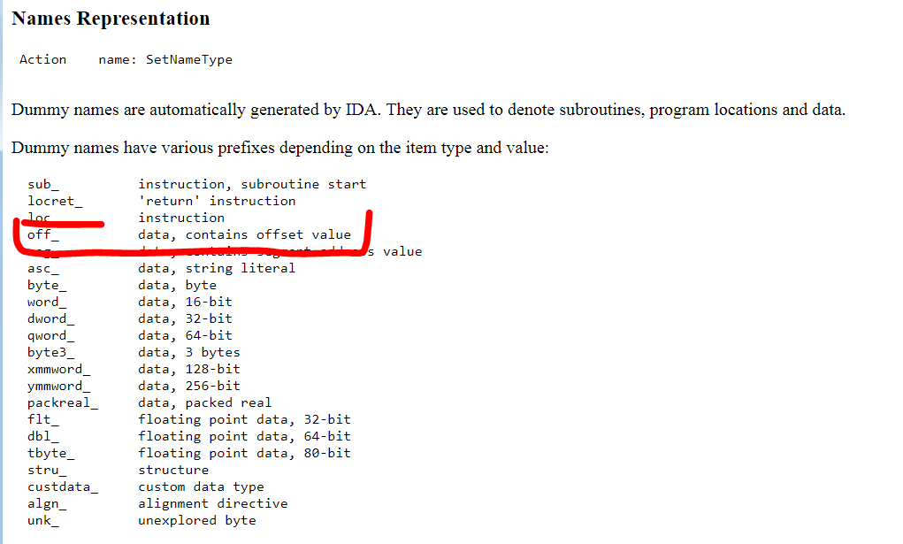

Таким образом, вы должны увидеть содержимое, которое будет помещено в регистр **RCX**.

Здесь мы это видим. По адресу **0x14000D088** добавляется префикс **OFF\_**, поскольку его содержимое является смещением или указателем. В этом случае его значение равно **0x14000D000**, содержимое которого является строкой **ASC**, поэтому этот адрес имеет префикс **ASC\_** впереди.

Т.е., проще говоря, у нас есть строка, и этот другой адрес хранит смещение или её адрес.

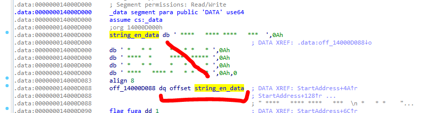

Теперь смотрится лучше. Переименуйте глобальную переменную в строку со звездочками как **STRING\_EN\_DATA**, а другая сохраняет ее смещение или адрес.

Здесь также, прежде чем резервировать место в стеке для переменных, сохраните **4** аргумента ниже адреса возврата.

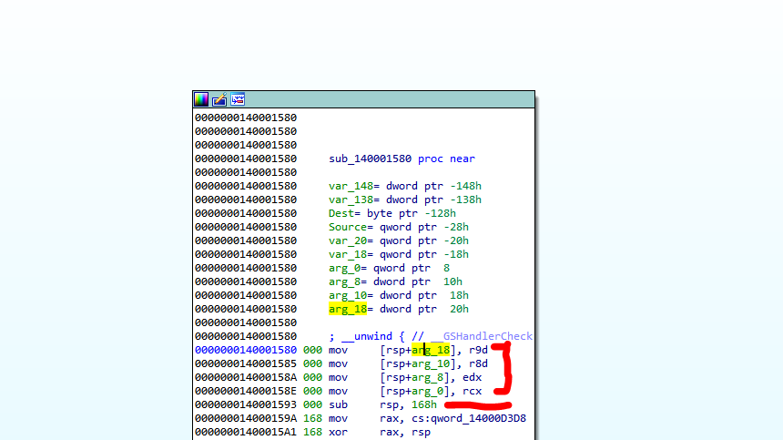

Регистр **RCX** был адресом **STRING\_EN\_DATA.**

Другие три аргумента являются константами.

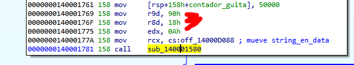

Я изменил эти имена.

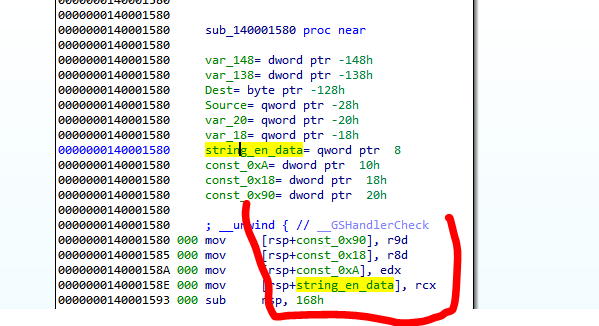

С этим я могу продолжить реверсинг, но если я захочу распространить переменные.
**\_\_INT64 \_\_USERCALL SUB\_140001580@&lt;RAX&gt;\(CHAR \*STRING\_EN\_DATA@&lt;RCX&gt;, INT CONST\_0XA@&lt;EDX&gt;, INT CONST\_0X18@&lt;R8D&gt;, INT CONST\_0X90@&lt;R9D&gt;\);**

И у меня получается ссылка.

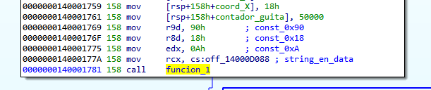

Я переименовываю функцию, хотя до сих пор не знаю, что она делает, чтобы она была более заметной, когда к ней обращаются из другого места.

Затем у нас есть файл **COOKIE**. Программа читает их из глобальной переменной в секции данных, которую я переименую.


И также есть локальная переменная **COOKIE**.

Перед входом в цикл скопируется адрес строки **STRING\_EN\_DATA** в другую переменную и инициализируется счетчик в ноль.


Затем программа вызывает функцию **STRCHR**. Она ищет байт **0xA**. Функция возвращает указатель на первое вхождение этого символа в строке или ноль, если она не находит его.


Мы видим, что строка имеет несколько символов **0xA**, другими словами это строка с несколькими строками.


Поэтому я переименовываю переменную, в которой сохраняется указатель как **P\_NEXT\_LINE**, и вижу, что, когда больше не находится **0xA**, программа выходит из цикла.

Также мы видим, что **STRING\_EN\_DATA** всегда указывает на начало строки и никогда не меняется, поскольку она читает только после инициализации указанной переменной.


Тем не менее, **STRING\_EN\_DATA\_2** в начале аналогична **STRING\_EN\_DATA**, но есть доступ на запись к указанной переменной, поэтому она изменит свое значение.


Мы видим, что перед выходом повторяется цикл.


Читается указателя на следующую строку увеличивает его, поскольку он указывает на **0xA**, чтобы пропустить этот символ и сохранить его в **STRING\_EN\_DATA\_2**, так что последний в каждом цикле будет увеличиваться, сохраняя указатель, который увеличивается построчно.

Поэтому я переименую его в **P\_LINEA\_STRING\_EN\_DATA**, а другой изменю на **P\_SIGUIENTE\_0XA**, поскольку он всегда будет указывать на **0xA**, как это выглядит в **STRCHR**.


Итак, мы видим, что цикл будет повторять строку за строкой, а поскольку **P\_LINEA\_STRING\_EN\_DATA** всегда указывает на следующую строку, когда строки заканчиваются и больше нет **0xA** в строке программа выходит из цикла. Теперь давайте посмотрим, что программа делает в цикле.

Мы видим, что есть вызов функции **STRNCPY**. **COUNT** или количество копируемых байтов происходит из вычитания двух адресов. Из **P\_LINEA\_STRING\_EN\_DATA** и из следующего адреса **0xA**. Т.е программа скопировала строку. Поскольку источник - это то же самое **P\_LINEA\_STRING\_EN\_DATA** и назначение это **DEST**, который является буфером назначения.


Если мы сделаем правой кнопкой мыши и выберем - **ARRAY** в **DEST** в представлении стека.


Здесь мы видим целевой буфер длиной **256** байт.


Снова пересчитывается размер строки, вычитая адрес 0**xA** из следующей строки от её начала и перемещая результат в регистр **R9D**.


Мы видим, что счетчик увеличивается при каждом цикле.


Но также счетчик добавляется к тому, что он читает из переменной **CONST\_0xA**, а затем передает это значение в качестве второго аргумента, поэтому в регистре **EDX** будет **CONST\_0XA\_MAS\_COUNTER.**


Здесь есть **4** аргумента внутри функции.


Если я хочу распространить переменные с помощью с **SET** **TYPE**.
**\_\_INT64 \_\_USERCALL SUB\_140001580@&lt;RAX&gt;\(CHAR \* P\_DEST@&lt;RCX&gt;, INT CONST\_0XA\_MAS\_CONTADOR@&lt;EDX&gt;, INT CONST\_0X18@&lt;R8D&gt;, INT NLENGHT@&lt;R9D&gt;\);**

И у меня получается ссылка.


Мы видим, что программа собирается войти в цикл, она инициализирует счетчик в ноль, чтобы отличить его от родительской функции. Я переименую его в **COUNTER\_LOOP\_ACTUAL**.


Этот блок увеличивает счетчик на один внутри цикла.


И поскольку переменная считается от нуля и увеличивается на один каждый раз, выходной результат равен **NLENGHT**, т. е. длине строки. \(**JNB**, если результат не ниже, т.е. если он равен или больше\)


Внутри цикла программа берет начальный адрес строки и прибавляет счетчик, т.е. берет первый байт строки и сравнивает его со значением **0x20**, чтобы увидеть, является ли символ пробелом.


Мы помним, что каждая строка состоит из пробелов и звездочек.

В **HEX\_DUMP** я вижу строку. Это **0x20** \(пробелы\) и **0X2A** \(звездочки\)


Если символ является пробелом, программа переходит к зеленому блоку, иначе к другому.

Мы помним, что когда ищем **0xA** и сохраняем указатель **INC EAX**, чтобы пропустить **0xA**, поэтому, если символ не является пробелом, он будет звездочкой, поскольку **0xA** от начала пропускается путем увеличения указателя.


Таким образом, мы можем думать, что если это не пробел, то это звездочка.


Осталось также увидеть, что такое **ARG\_20**, поскольку существует только **4** аргумента, а у дочерней функции только **5**, **5тый** - это **ARG\_20**.


Напомним, что в этом компиляторе, родительская функция исполняет **SUB** **RSP**, **168** чтобы освободить место для собственных переменных, а также освободить место для аргументов, которым необходимо передать регистры в дочернюю функцию \(**4QWORDS**\),


Если в родительской функции я определяю **4** **QWORDS** выше зарезервированного пространства, чтобы использовать в качестве аргументов, а следующая функция читает **5** аргументов, **5**-й будет локальной переменной родительской функции, которая выше, в этом случае это **CONST\_0x90\_B**.

На следующем рисунке я определил больше пространства, чем создала отцовская функция при выполнении **SUB** **RSP**, **XXX**, поверх той, которая ему нужна для локальных переменных, например, **4QWORDS** \(**VAR**\_**168**, **VAR\_160**, **VAR\_158** и **VAR\_150**\)


Следовательно, мы передали еще один аргумент, который будет переменной родительской функции **CONST\_0X90**.


Мы также видим, что существует массив слов с именем **ATTRIBUTE.** Я преобразую его в массив длиной **0x256** слов.


Мы также видим, что когда это пробел, программа записывает ноль в массив **ATTRIBUTE**, а когда это звездочка, программа записывает **0x90**.


Другими словами для каждой строки запишется слово **0x00** в пробелах и слово **0x90**, где были звездочки.

Мы видим, что программа собирается снова записать в консоль. Программа возвращается, чтобы найти дескриптор **OUTPUT**. Она передает координаты **X** и **Y** и в виде строки для печати передает указатель на **ATTRIBUTE**,


Очевидно, что в выходных данных, если я запускаю программа, я вижу, что каждый раз, когда она проходит через функцию **WRITECONSOLEOUTPUTATTRIBUTE** в каждой строке атрибута, она создает синий рисунок.


И создают цветную строку.


Так что я могу переименовать функцию в **DIBUJAR\_STRING.**


Хотя я могу уточнить, что в этом вызове подтягивается **BCRA**.


Мы также видим, что если вы запустите программа, она поменяет цвет на желтый.


А чуть ниже на красный.


Мы видим, что среди аргументов функции **WRITECONSOLEOUTPUTATTRIBUTE**, атрибуты символов указывают в другое место.


Хорошо, **0x90** как мы писали в начало, это сумма этих двух констант

**\#define BACKGROUND\_BLUE 0x0010
\#define BACKGROUND\_INTENSITY 0x0080**

Вот почему это дает синий цвет.

Чтобы получить желтый цвет, нужно сочетание красного и зеленого.

**\#define BACKGROUND\_GREEN 0x0020
\#define BACKGROUND\_RED 0x0040
\#define BACKGROUND\_INTENSITY 0x0080**


Здесь мы видим, что программа вызывает все те же аргументы, кроме **0xE0** от **Ox90**, чтобы изменить цвет на желтый.

И красный цвет получается так

**\#define BACKGROUND\_RED 0x0040
\#define BACKGROUND\_INTENSITY 0x0080**

Помните, что **CONTADOR\_GUITA** и **CONTADOR\_GUITA\_2** равны в начале цикла


Далее вызывается **GETTICKCOUNT.**


Но мы можем считать, что программа возвращает значение, которое является случайным и увеличивается, и это значение делится на константу **0x7D0**.


И результат сохраняется в **EAX**, остаток - в **EDX.**


Поэтому **COUNTER\_GUITA** на этом этапе будет меньше, чем **CONTADOR\_GUITA₂.**


И когда **COUNTER\_GUITA** будет меньше **30000**, а **COUNTER\_GUITA\_2** будет больше, программа изменит вывод на желтый, то же самое произойдет, когда **COUNTER\_GUITA** будет меньше **10000**, а **COUNTER\_GUITA\_2** больше **10000**.

До тех пор пока **COUNTER\_GUITA** не станет равным нулю, и программа перейдет к красному блоку, который завершает программу.


Мы видим, что все это заставляет программу просто запускаться. Это является ее потоком. Теперь мы должны увидеть главную функцию, то есть ту, которая создает этот поток, чтобы увидеть, есть ли у нас возможность повлиять на что-то здесь, чтобы остановить счетчик, потому что здесь "легально" мы видели, что не можем ни на что повлиять.

Хорошо. Давайте начнем анализировать главную функцию, где создан поток, который мы видели ранее.


Здесь мы видим, что с помощью **SUB RSP, RAX**, резервируются **0x1088** байтов пространства в стеке для локальных переменных, буферов и т.д. Мы также переименовываем переменную, в которой хранится **COOKIE**.

Мы знаем, что можем перейти к **RECV** и работать напрямую с данными, которые мы отправили, потому что мы уже видели, что сервер прослушивает порт, но мы сделаем это медленно и максимально полно.


Первое, что делаете программа в первом вызове, это вызывает функцию **WSASTARTUP**.


IDA показывает нам аргументы. Первый из которых передается в **ECX**, и это версия. Здесь он устанавливается в 0x202 и сохраняется в указанной переменной **WVERSIONREQUESTED**, затем **ECX**читается как первый аргумент.

Второй аргумент, который передается через **EDX**, является структурой типа **WSADATA**.


Если мы перейдем на вкладку структуры, мы увидим это


Также в **LOCAL** **TYPES.**


Мы видим, что в начале переменная устанавливает в ноль. Мы будем называть ее **FLAG\_CORRECT**, потому что если она равна **1**, то это потому, что все в порядке.


Переменная равна **1**, если поле **WVERSION**, которое было заполнено при вызове **WSASTARTUP**, равна переменной **WVERSIONREQUESTED**, которую мы передали ему в качестве аргумента.

Если они равны, программа устанавливает переменную **FLAG\_CORRECT** в единицу, отмечая, что ошибки нет, и возвращает ее в **EAX** при выходе из этой функции в качестве возвращаемого значения.

Я переименовал функцию в нечто более близкое к тому, что она делает


Если переменная равно **1**, все в порядке, и программа продолжается здесь


Первый аргумент в **RCX** - это адрес строки "**0.0.0.0**"


Это произойдет на моей машине по адресу **0X13F7ED238**. Не путайте с именем **A0000**.

**IDA** всегда помещает строки в имя, которое начинается с **A**, а затем имеет некоторое описание строки, например, означающее, что оно указывает "**A 0 0 0 0**"


В опциях есть префикс **А**, и он создаст имя. Даже если эта опция не может быть изменена и имеет немедленный эффект, это будет сделано при следующем анализе.

Мы видим, что я могу использовать имя строки, которое **IDA** дает мне для удобства, и если я напишу это в комментариях, двойной щелчок по тому же комментарию приведет меня к строке. Это будет очень удобно.


Я делаю двойной щелчок здесь.


Отлично, продолжаем.

**EDX** будет иметь значение **41414**, которое будет портом, в котором программа будет прослушиваться.


**NETSTAT** -ano в консоли с правами администратора покажет нам процессы и порты. В этом случае вы видите **41414**.

И третий аргумент в **R8** это указатель на **QWORD** с именем **S**


Мы видим другую переменную, которая сохранит флаг, если программа может выполнить успешное прослушивание. Поэтому мы переменовываем переменную в **FLAG\_LISTEN**


Затем вызовите **HTONS**, чтобы перевести значение порта в **BIG\_ENDIAN** \(darlo vuelta en criollo\)


Существует также переменная имени типа **SOCKADDR**.


В структурах.


И в **LOCAL TYPES.**


Затем вызывается сокет.


Мы видим, что в поле **SA\_FAMILY** сохраняется **2**, и затем три аргумента для сокета передаются непосредственно как константы, а в **AF**, что является семейством адресов, программа передает **2**напрямую. \(**IPV4**\)


Тип это **1** \(**SOCK**\_**STREAM**\) что соответствует **TCP**.


И протокол будет нулевым \(**НЕ** **ОПРЕДЕЛЕН**\)


И возвращаемое значение будет дескриптором сокета. \(То, что мы обычно называем дескриптором сокета\)


Затем вызывается **BIND** с тремя аргументами: длина имени структуры **SOCKADDR**, затем указатель на то же имя структуры и сокет **S**.


Если вы поместите **BIND** в этот порт, вы получите ноль. Если вы не получите ошибку, которая видна в таблице с информацией.

Если программа получит ноль, она вызовет **LISTEN.**


Здесь мы видим информацию, что один из аргументов - это сокет, а другой - число, называемое **BACKLOG**, которое в нашем случае будет равно нулю.


Здесь есть нулевое значение, что делает


Также, если все правильно, программа возвратит нуль.


Сокет, который был в локальной переменной **S**, сохранит его в содержимом **P\_S** для использования в родительских функциях

Я дал имя функции.


Если возвращается **1**, программа продолжает выполнение здесь.

Первый вызов - эта функция без аргументов.


Посмотрим что делает эта функция.


Мы видим, что она не имеет аргументов, непосредственно резервирует пространство для переменных с помощью **Sub** **RSP**, **0x168.**


Мы видим вызов **MEMSET** с аргументом **0x20.** Другими словами должен заполниться буфер, длина которого в аргументе **SIZE** равна **0x100.** Также в **IDA**, если я перехожу к статическому представлению стека, я могу сделать это, дважды щелкнув по **CHARACTER** или любой переменной.


Я вижу пустое пространство в буфере. Если щелкнуть правой кнопкой мыши и выбрать **ARRAY** мне говорится, что длина равна **256**.


Здесь существует буфер с именем **CHARACTER** размером **256** байт или **0x100H**.


Мы видим, что цикл будет повторяться, пока счетчик не достигнет **0x50**.


Ещё раз получается хэндл вывода и вызывается **WRITECONSOLEOUTPUTCHARACTERA**,

Если я запускаю программа, в этом я не вижу записи буфера со значением **0x2020** в каждом слове, так как буфер инициализируется пробелами **0x20**. Это просто нужно для рисования в консоли, Здесь нет ничего интересного нет. Продолжаем.


Затем устанавливается позиция курсора, обнуляя поля **X** и **Y**, передавая их как **DWORD**, поскольку они являются последовательными, и каждое из них является словом.


Затем создаётся поток, который мы уже проанализировали с помощью **CREATETHREAD**, передав его в качестве начального адреса **STARTADDRESS.** Эта функция уже проанализирована.


После запуска потока, программа напечатает **TCP** **SERVER** **ACTIVATED.**


Y ya empezaría la parte interesante, normalmente uno en un server buscaría el recv y empezaría a reversear desde allí, pero acá la idea es aprender y ser detallado para practicar, así que seguimos.


Перемещается курсор, так как **Y** теперь равен **1**.


Происходит вывод "**WAITING FOR CLIENT CONNECTIONS**" и вызывается функция **ACCEPT**.


В этом случае **ACCEPT** разрешает входящее соединение и еще не назначает дескриптор сокета, который прослушивает, как мы уже видели, и здесь будет первый аргумент, но в регистре **RAX** вернется другой дескриптор, который будет дескриптором соединения с этим конкретным клиентом.


Здесь находятся 3 аргумента: указатель на **ADDRLEN**, в данном случае **0x10**, указатель на **ADDR**, который получает адрес того, что подключается, и последний - сокет **S**. В регистре **RAX** возвращается дескриптор этого соединения, который был установлен.


Мы видим, что если я запущу сервер и установлю **BP** при возврате **ACCEPT**, то **IDA** не остановится, если я не отправлю правильный пакет на правильный порт, как в этом случае. Здесь отправил пакет и отладчик остановился.


Затем вызывается другая похожая функция, которая рисует что-то в консоли.


Мы это уже проходили, я не собираюсь анализировать это снова.

Здесь печатается **NEW CONECTION ACCEPTED** и идет переход в функцию в **RECV**, где начинается то что нужно, поскольку, когда она получает данные, которые я могу отправить ей, если в программе есть какая-либо уязвимость, она может на нее повлиять.

Мы видим, что длина того, что вы можете получить, будет максимум **0x1000**, флаги будут равны нулю, то, что я отправлю в буфере **BUF**, будет сохранено, и первым аргументом в **RCX** будет **HANDLE\_CONNECTION**.


Если все прошло хорошо, возвращаемым значением будет количество полученных байтов.


Давайте посмотрим длину буфера, куда программа будет получать данные.


Так что все в порядке, буфер не переполнится.


Мы видим, что переменная **ADDRLEN**, которая в **ACCEPT** использовала ее для длины **ADDR**, теперь повторно использует ее для получения количества полученных байтов.


Обычно, когда переменная используется повторно, я ставлю новое имя после нескольких подчеркиваний, чтобы оно выглядело как два разных применения.

После печати количества полученных байтов идет функция. Посмотрим, что она делает.


Она имеет два аргумента. Первый в **ECX** - количество полученных байтов, а второй в **RDX** - указатель на буфер, в котором я храню данные, которые отправляю.


Мы видим, что локально я ставлю имя текущего значения повторно используемой переменной, чтобы не перепутать.

Если бы я хотел распространить с **SET** **TYPE**, то делаю так**.

\_\_INT64 \_\_USERCALL FUNCION\_2@&lt;RAX&gt;\(INT CANTIDAD\_BYTES\_RECIBIDOS@&lt;RCX&gt;, CHAR \* P\_BUF@&lt;EDX&gt;\);**

Здесь нужно распространить переменные.

Мы видим, что программа сравнивает с помощью **STRNCMP** первые **6** байтов данных, которые вы отправляете, со строкой "**Hello**".


Если функция возвращает ноль, то они равны, и флаг установлен в **1**.

Поскольку при выходе из этой функции, если она возвращает **1**, происходит рукопожатие, я переименую функцию в **CHECK\_HANDSHAKE**.


Хорошо, как мы видим, если мы передали "**Hello**" будет действительным рукопожатие.

Затем программе возвращает в **SEND** строку, которая начинается с "**Hi** и несколько пробелов" длиной **8**, чтобы не путать с другим **BUF**, который находится в секции данных. Я собираюсь переименовать его, чтобы избежать проблем.


Теперь смотрится лучше. Длина данных, которые вы мне отправите, будет **8**. Здесь нет проблем.


Здесь программа сохраняет отправленные байты, затем выводит "**WAITING FOR REQUEST**", происходит вызов функции, а затем соединение с клиентом закрывается, и программа возвращается, чтобы принять ожидание другого, поэтому все должно быть приготовлено в этой последней функции, которая находится до **CLOSESOCKET**.


Мы видим, что у него есть единственный аргумент - **HANDLE\_CONNECTION**.

После сохранения аргумента резервируется место для переменных


Тот, кто хочет распространять нужно написать так

**\_\_INT64 \_\_USERCALL FUNCION\_2@&lt;RAX&gt;\(\_\_INT64 HANDLE\_CONEXION@&lt;RCX&gt;\);**


Затем вызывается другой **RECV** с тем же **HANDLE\_CONNECTION**, но длиной **0x10**. Давайте посмотрим буфер, в который поступают данные.


Поскольку размер буфера составляет **0x10** т.е. **16** байтов, он будет включать переменную **BUF** и три переменные **224**, **220** и **21C**.


Если я хочу, я могу создать структуру для этого буфера.

Здесь у меня есть **16** байтов длиной с **4** **DWORDS**, тогда я увижу, какое конкретное имя поставить каждому из них.


И переменную переименую в **MY\_BUF.**


Здесь сохраняется количество полученных байтов, которых может быть не более **0x10** т.е. **16**.


Сравнивается количество полученных байтов с **0x10**, и оно должно быть именно этим значением, потому что, если оно не меньше, оно будет равно или больше, и выше оно не может быть, потому что у recv было максимум **0x10**, поэтому он принимает только **0x10.**


Мы видим, что программа собирается выполнить еще одно **RECV** с тем же **HANDLE\_CONNECTION**, но в этом случае размер равен **CAMPO\_0** того, что я отправил в предыдущем пакете из **16** байтов, и программа сохранит результат в **VAR\_218**, которая будет буфером для этого **RECV**.


Мы видим, что этот буфер составляет **512** байт, и я мог бы отправить ему больше данных, так как размер **RECV**, который я обрабатываю через **CAMPO\_0**. Проблема заключается в том, что вы перезаписываете **COOKIE**, и это приводит к закрытию программы, и в **64**-битных файлах нет исключения в стеке, так что это пока не приведет к переполнению.


Также, я переименую переменную в **BUF\_512\_TERCER\_RECV.**


И здесь я переименую **CAMPO\_0**, я также вижу, что я использовал его повторно, чтобы сохранить полученные байты.


Y bueno quedo largo pero yo me entiendo jeje, con las variables reusadas pasa esto.


Затем выполняется сравнение со знаком, просто следите, если **FIELD\_3** меньше нуля.


Я переименую переменную.

Затем идет сравнение без знака, только если **CAMPO\_2** меньше или равно **0x200**.


Я переименую её.


Кроме того, сообщения об ошибках дают мне представление об именах полей, **CAMPO\_3** будет смещением, а **CAMPO\_2** будет равно уровню.


Сейчас смотрится лучше.

Поле **1** является операцией сравнения с **0x11111111** или **0x22222222**, и если , то программа идет на **INVALID** **OPERATION**, поэтому мы переименовываем его. Мы видим структуру второго пакета.

Мы видим структуру второго пакета.


Мы видим, что есть две разные операции и **SEND**. Мы должны изучить обе операции, чтобы увидеть, какая из них работает и почему.


В этом компиляторе резервируются **4** **QWORDS** над пространством переменных, так что дочерняя функция хранит аргументы, которые передаются через регистры.


Таким образом, поскольку дочерняя функция имеет **5** аргументов, **5**-й будет **VAR\_248**.

Я переименую переменную в **CONST\_0**, так как программа пишет туда ноль.


Давайте сначала проанализируем операцию **0x22222222.**


Другие **4** аргумента такие.

**\_\_INT64 \_\_USERCALL OP\_0X22222222@&lt;RAX&gt;\(INT LEVEL\_MENOR\_O\_IGUAL\_QUE\_0X200 @&lt;ECX&gt;, CHAR \* P\_BUF\_512\_TERCER\_RECV@&lt;RDX&gt;, INT BYTES\_RECIBIDOS\_3ER\_RECV@&lt;R8D&gt;, INT OFFSET\_VALOR\_NEGATIVO@&lt;R9D&gt;\);**

Здесь распространяются аргументы.


Дело в том, что это рекурсивная функция, одинаковая в каждом вызове.


Мы видим, что когда функция повторяется, аргументы совпадают, только уменьшается уровень. Мы видели, что он не может быть больше или равен **0x200**, поэтому, если вы передадите **0x200**, будете повторяться то же самое **0x200** раз, уменьшая уровень в каждом вызове.

Другими словами, функция будет продолжать повторяться только уменьшая уровень и больше ничего не будет делать.

Даже пятый аргумент каждый раз, когда он повторяется, устанавливается в нуль при каждом повторении, поэтому он также не изменится.


Это всё будет повторяться, ничего не делая, пока уровень не уменьшится и не достигнет нуля.


В этом случае программа перейдёт к этому блоку, где вы перепишите с помощью **OK** на некоторую часть стека выше **BUFFER\_512\_TERCER\_RECV**, так как указатель на него добавляет отрицательное смещение.

Мы видим, что **OK** - это строка из **2** байтов и конечного нуля.


Мы видим, что над буфером находится переменная **CONST\_0** в родительской функции.


Дело в том, что после того, как программа достигнете уровня до нуля и выполнит функцию strcpy, вы выйдете из функции и вернетесь сюда.


И пройдет через возврат каждого уровня, в противоположном направлении, оставляя каждую функцию по тому же адресу.

Дело в том, что переменная **CONST\_0** всегда будет равна **0** и программа не будет переходить к функции **STRNCAT**, которая будет пропущена, до уровня **0X1FF**, который был выполнен первым и который имеет переменную **CONST\_0**, и которую мы перезаписали с помощью **OK**, поэтому существует только один раз перейти к функции **STRNCAT**.


Этот уровень будет **0x200**, так как это максимальный уровень и он будет счетчиком **STRNCAT**, поэтому вы должны попытаться отправить максимально возможное значение, в данном случае **0x200**, чтобы объединить много данных.


**SOURCE** - это указатель на пакет, отправленный **RECV** ему в третьем параметре, который будет скопирован после строки **OK**, поэтому я могу перейти к переменным в стеке, которые находятся ниже **CONST\_0**, включая очень ценную переменную, такую как размер **SEND.**


Если я перезапишу этот размер с большим значением, чем у меня, я мог бы получить утечку из стека, включая **COOKIE**, и адрес возврата, который позволит мне в следующем пакете отправить длину, поскольку исполняемый файл имеет **ASLR**.

Прежде чем мы начнем делать скрипт, я должен изучить другую функцию **OP\_0X11111111**, чтобы увидеть, что произойдет, если я выберу её вместо **OP\_0X22222222**.


Здесь я помещу такие аргументы и если я хочу распространять их, нужно ввести следующее

**\_\_INT64 \_\_USERCALL OP\_0X11111111@&lt;RAX&gt;\(INT LEVEL\_MENOR\_O\_IGUAL\_QUE\_0X200 @&lt;ECX&gt;, CHAR \* P\_BUF\_512\_TERCER\_RECV@&lt;RDX&gt;, INT BYTES\_RECIBIDOS\_3ER\_RECV@&lt;R8D&gt;, INT OFFSET\_VALOR\_NEGATIVO@&lt;R9D&gt;\);**

Здесь распространяются значения.


Мы видим, что так же, как в **OP\_0X22222222** программа будет повторять ту же функцию, только изменяя уровень, который уменьшается. В то время как он будет повторяться до **0x200** раз в зависимости от уровня, который мы установили, и по мере его снижения счетчик достигнет ноль. Когда он это сделает, программа перейдет к **STRCPY**.


Здесь программа достигает функции **STRCPY** с уровнем равным **0**.


В этом случае программа не добавляет отрицательное смещение к **DESTINO**, поэтому программа будет писать только **OK** в начале третьего буфера пакета.

Также следует отметить, что строка **OK** не совпадает с функцией **0x22222222**, она имеет длину пять символов и имеет три точки после "**OK…**".

Здесь есть обе строки.


Затем, возвращаясь к адресу возврата при каждом повторения, программа переходит к функции **STRNCAT**.


**DESTINATION** будет буфером **THIRD\_RECV**, где в начале будет "**OK…**" куда я копирую в функцию **strcpy**, но после того, как эта строка заканчивается, это будет зависеть от того, что мы указываем в **SOURCE**, который будет тем же указателем плюс отрицательное смещение. Другими словами, мы можем добавить данные из верхней части буфера и вставить их в конце.

Эта функция **STRNCAT** будет повторяться каждый раз, когда программа будет возвращается из повторения, поэтому она будет повторяться и продолжать добавлять дополнительные данные ниже с начала буфера, что может привести к переполнению.

Также может случиться утечка, так как строка, которая будет в **DEST** в буфере, будет маленькой \(для строки "**OK ...**", которую я копирую, будет только **5** байтов, и она заканчивается нулем, что сделает ее зависимой от того, что находится над буфером, например, адрес возврата повторений, хотя не **COOKIE**, он не будет выше буфера.

Мы также помним, что в случае функции **OP\_0X22222222** программа только один раз прибыла бы в функцию **STRNCAT**. В случае **OP\_0X11111111** необходимо помнить, что когда она уменьшается и достигает уровня **0**, программа идет в функцию **STRCPY** и оттуда, поскольку она не зависит ни от каких **CONST\_0** во всех выходах всех уровней программа переходит в функцию **STRNCAT**.


Кроме того, поскольку количество, которое копирует в **COUNT**, является значением текущего уровня, и оно будет уменьшено, скопировано на уровень **1** будет только **1** байт. Далее, когда программа выйдет из **LEVEL2\_COPIARA** и так далее, до последнего уровня, который скопирует **0x1ff** и затем уже перейдет к отцовской функции.

Очевидно, что скопируется это количество байтов если нет нулей, потому что копируются строки, если уровень равен **0x150**, и есть ноль, копируюся только из **SOURCE** в ноль, а не в полный размер.

Хорошо. Таким образом, существует много возможностей. Мы можем сделать утечку данных на первом этапе и получить **COOKIE** и адреса исполняемых файлов, которые позволят нам переполнить во втором пакете и выполнить **ROP** и записать флаг, чтобы избежать утечки средств и запустить **CALC**.

Все это мы увидим во второй части туториала. Я посвятил анализу только первую часть, и дальше мне предлагается посмотреть, сможем ли мы создать скрипт с решением, а также подумать, есть ли еще возможные решения, потому что возможности очень велики.
