# Часть 66 - ч1

[\[Используемые материалы\]](.gitbook/assets/files/66.zip)

ТУТОРИАЛ ДЛЯ РЕШЕНИЯ ЗАДАНИЯ **NICO** ИЗ **EKOPARTY 2018** - ЧАСТЬ **2**.

Давайте сделаем скрипт на **PYTHON** для решения конкурсной задачи **NICO**, которую мы реверсировали в предыдущей части. Cкрипт основан на реверсинге, который мы делали, а также на решении, которое прислал мой дружбан **LUCAS KOW**, особенно это видно в части про **ROP**, и мы объясним, как это сделать.

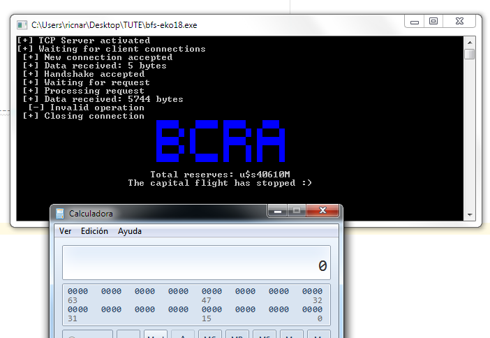

Если я запускаю скрипт **LUCAS**, я вижу что останавливается счетчик de la fuga de capitales\(сложно понять без запуска про что он говорит\) и что запускается калькулятор. Поэтому давайте посмотрим на это всё.

Очевидно, что, во-первых, устанавливается соединение с сервером, который будет прослушивать порт **41414**, как мы уже видели. В качестве **IP**-адреса я введу **127.0.0.1**, так как запускаю его на той же машине. Если сервер находится на удаленной машине, придется ввести **IP** машины, на которой работает этот сервер.

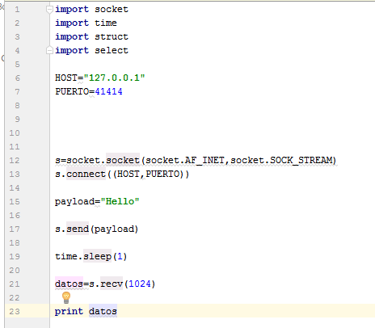

Здесь импортируется сокет и устанавливается соединение с ним. Напомним, что первый пакет назывался **HANDSHAKE**. Вам нужно отправить слово **HELLO**, и если все в порядке, программа вернёт **HI**.

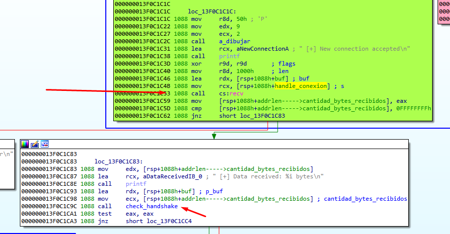

Давайте напомним, что это проверяется в функции, которую я переименовал в **CHECK\_HANDSHAKE** после первого **RECV**. Мы установим **BP** на возврате из функции **RECV**.

Сейчас, чтобы это было более удобнее я изменяю отладчик на **WINDBG**, который будет использоваться как локальный отладчик внутри **IDA**.

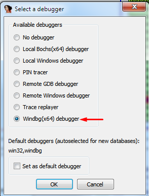

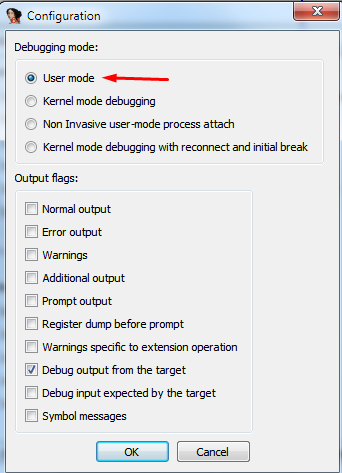

Конечно, нужно удалить в **PROCESS OPTIONS** любую **CONNECTION STRING** которая будет.

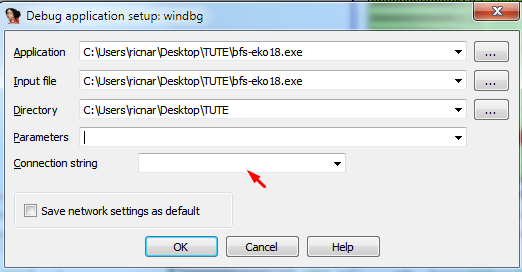

Я помещаю **BP** и нажимаю на **START**.

Отладчик останавливается.

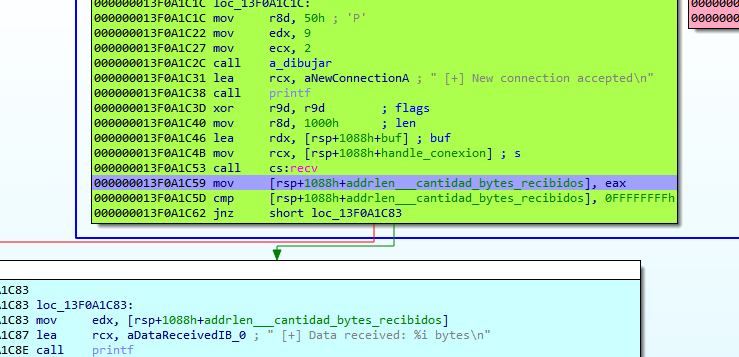

Кто хочет увидеть адрес в **WINDBG**, нужно выполнить эту команду.

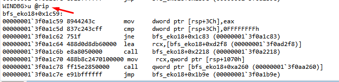

**WINDBG** показывает адрес как **IMAGEBASE** + **RVA.

RVA** это расстояние от **IMAGEBASE**.

В моём случае **RVA** = **0x1C59**.

В **IDA** нет возможности показывать адреса как базу плюс **RVA**, но есть возможность показать как смещение от функции, которой оно принадлежит.

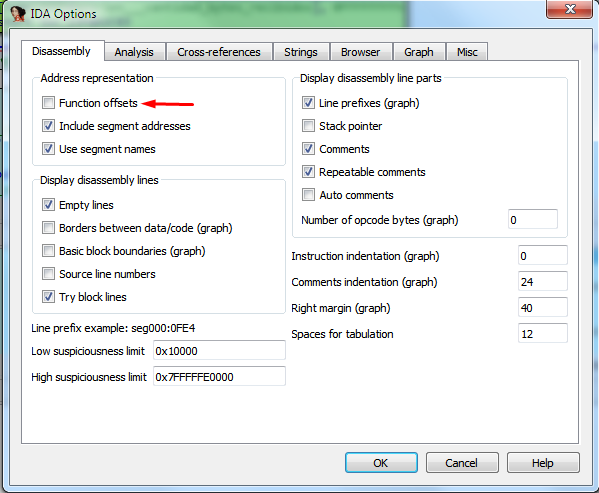

Если мы поставим эту галочку произойдут изменения.

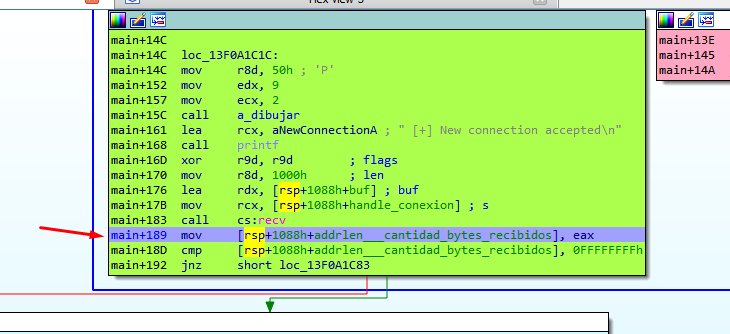

Таким образом, если мы назовем эту функцию как **MAIN**, название будет совпадать со всеми именами, так как все здесь будут в **MAIN** + **189**.

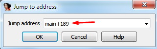

И это всё приведет нас на правильный адрес, конечно **RIP** будет продолжать показывать числовое значение.

Хотя сбоку будет показываться уточнение, которое равно **MAIN**+**189**.

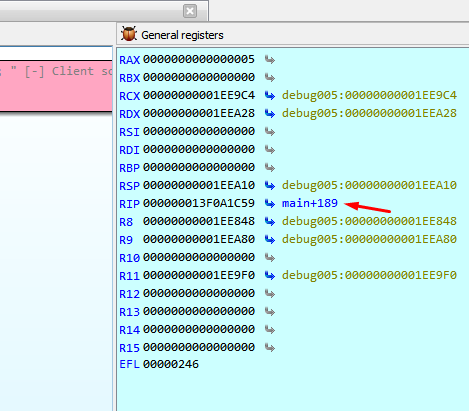

Я думаю, что таким образом будет легче следовать по пунктам, которые я Вам показываю, потому что, если мы поставим одинаковые имена, они будут совпадать.


Если я посмотрю сейчас, и увижу что отладчик остановился, я вижу, что есть в **BUF**, наведя указатель мыши на строку **HELLO**.

Если я пойду сюда и нажму на клавишу **A** у меня появится строка **ASCII**.

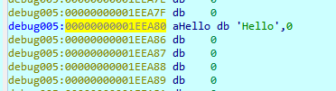

В **CHECK\_HANDSHAKE+27**, убедитесь, что вы переименовали функцию в то же имя, и вы можете перейти туда.

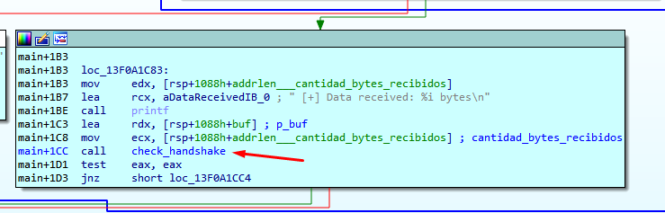

Она находится в **STRNCMP**. Если всё хорошо, функция вернет нуль, если обе строки одинаковые.

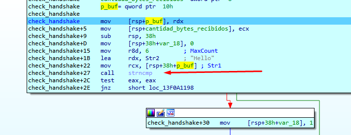

Поскольку строки одинаковые, в **FLAG\_OK** помещается **1**.

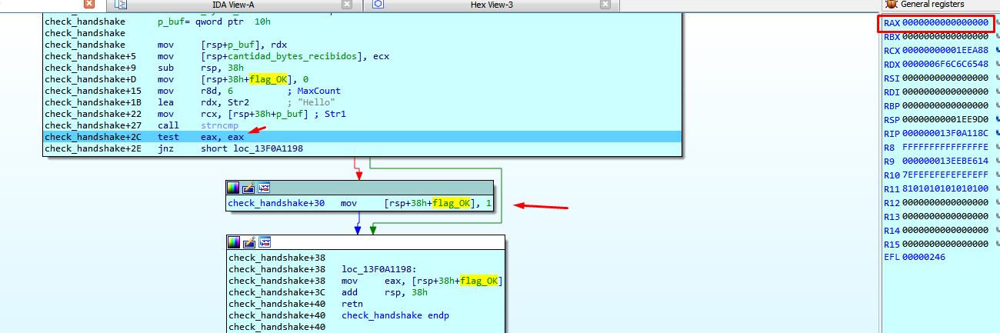

И затем программа пойдет на **HANDSHAKE** отвечая **HI**. И с этим мы понимаем, что у нас все в-порядке.

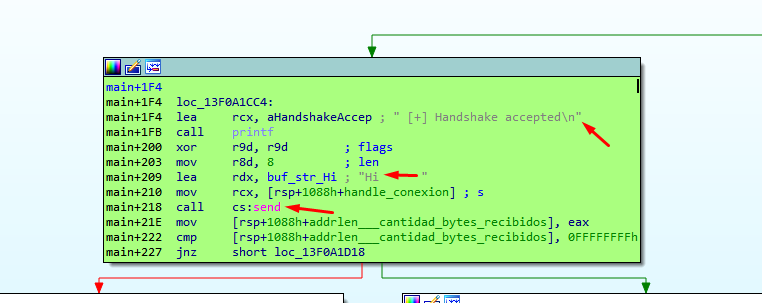

В скрипте я печатаю в ответе **HI**.

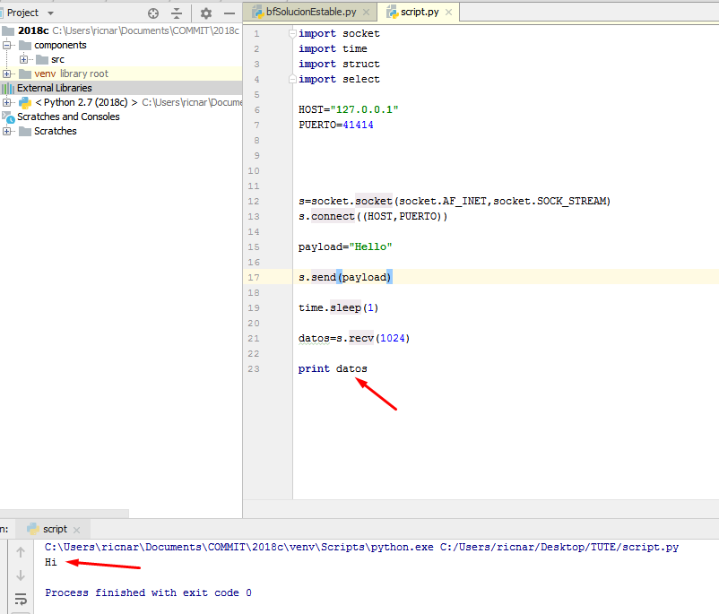

Затем я останавливаю сервер и обращаю внимание, что программа переходит на выполнение этой функции. Я переименовал её в **RECV\_AND\_PARSE**.

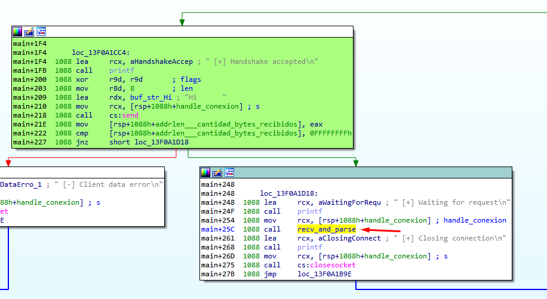

Если вы переименуете её также сможете добавить смещение через начало функции.

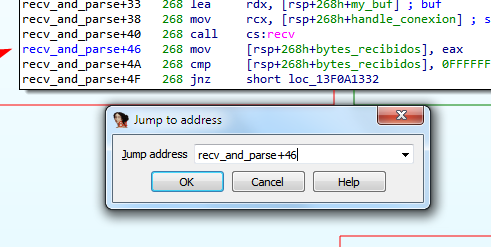

В **RECV\_AND\_PARSE+46** мы вернемся на **RECV**, хотя мы знаем, что он был **16** байтов, из **4 DWORDS**. Мы бы создали структуру и уже бы примерно знали сколько равна каждая.

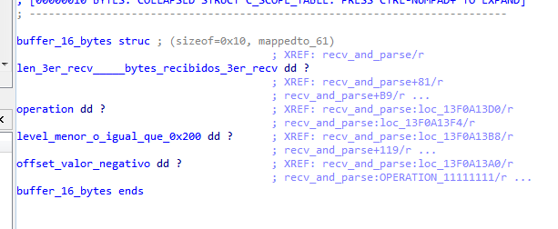

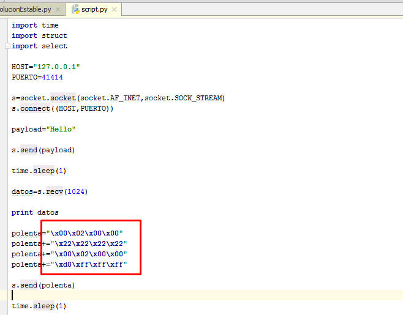

Здесь мы видим четыре значения. Первое - это длина **3-**го **RECV**, который будет вызываться позже. В этом случае он пропускает **0x200** байт, потому что, как мы видели, мы могли бы переполниться здесь, но передав больше данных, это приведет к сбою программы при перезаписи **COOKIE**.

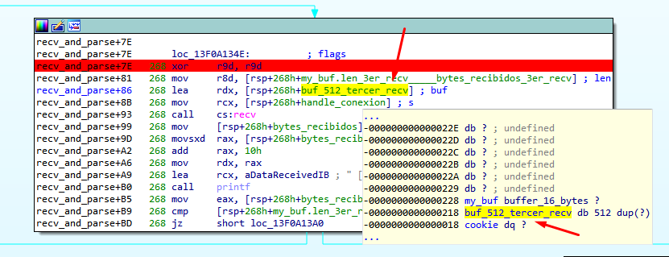

Давайте вспомним, что буфер, в который вы записали **3**-е **RECV**, был **0x200** т.е. **512** байт, поэтому, если мы передадим больше, программа сломается, чуть ниже есть **COOKIE**, поэтому значение будет **0x200**.

Следующим значением будет код операции, который мы будем выполнять. Мы увидели, что **0x22222222** позволит нам лучше читать не только адрес возврата, но и **COOKIE** безопасности, что очень важно, поэтому второй **DWORD** равен **0x22222222**.

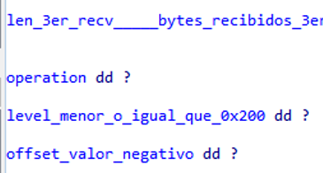

Третьим **DWORD** был уровень \(меньше или равный **0x200**\). Напомним, что он должен быть настолько большим, насколько это возможно, потому что в **STRNCAT** он использует его в как **COUNT**копируемой величины, и поскольку **0x200** - максимум. Мы будем использовать это значение.

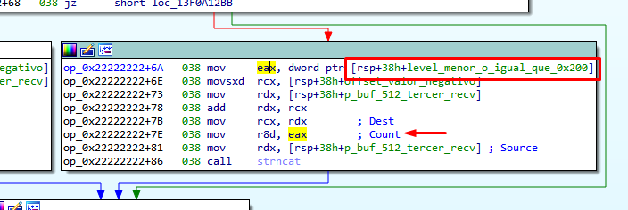

Последнее это отрицательное смещение. Мы помним, что оно не может быть каким-либо значением, потому что оно должно быть добавлено к **P\_BUFFER\_512\_TERCER\_RECV**, и результирующий адрес будет там, где программа пишет **OK** в **STRCPY**.

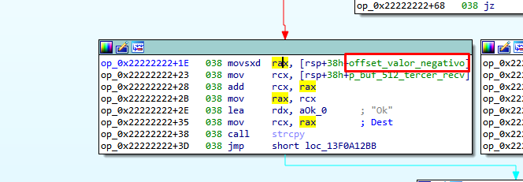

Расстояние до **CONST\_0** это **0x48** поэтому мы перейдем как к смещению **0x48**.

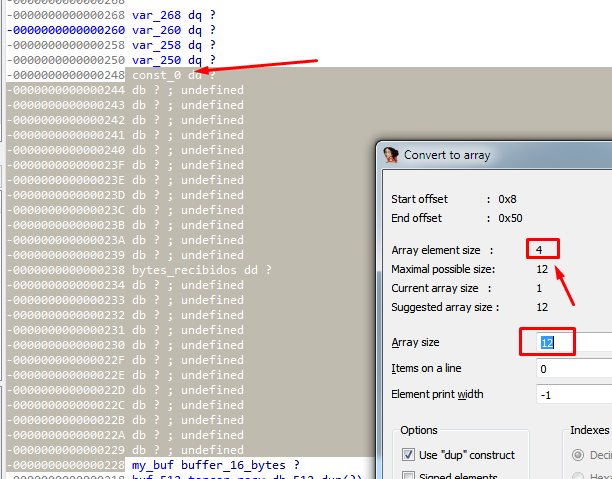

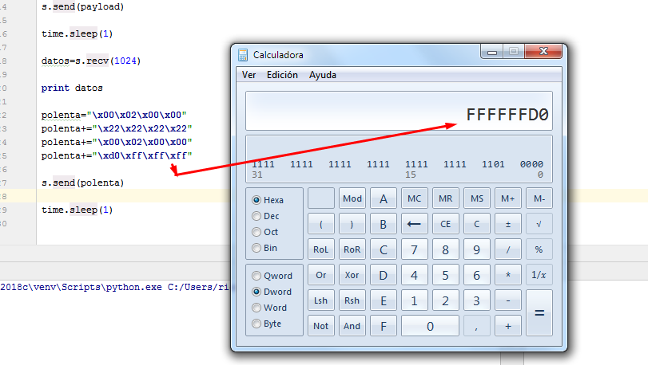

Что равно **0x48**.

После этого мы напишем **ОК** в **CONST\_0**, которая, как мы знали, является тем же аргументом функции **OP\_0x22222222**.

Это позволит нам в первом повторе, когда программа пройдет через все обратные адреса, достичь функции **STRNCAT**, которая все сделает.

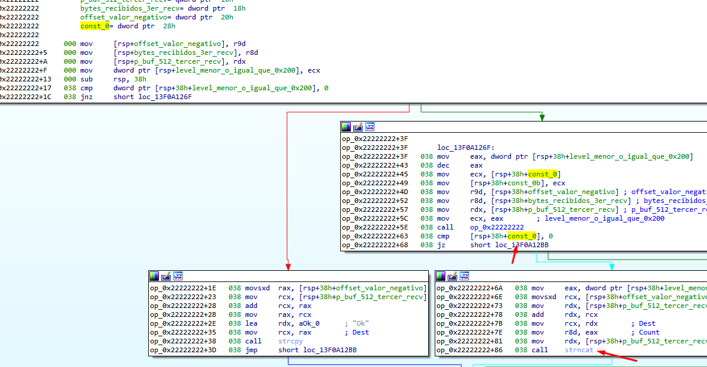
Здесь находится то, что мы будем засылать на данный момент.

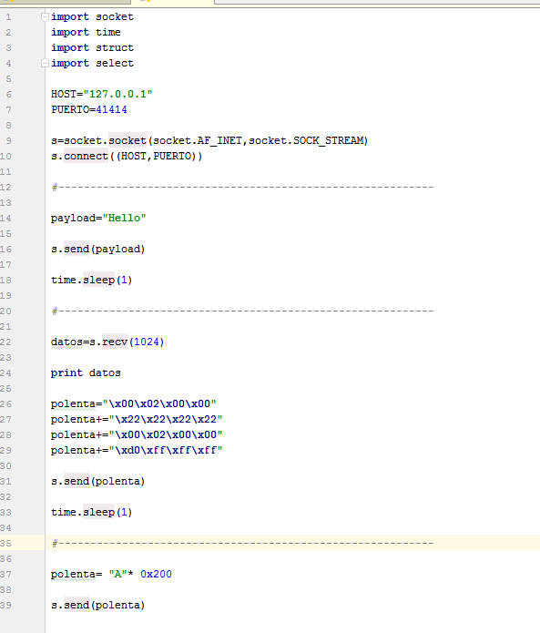

Я поставлю **BP** на **STRCPY**.

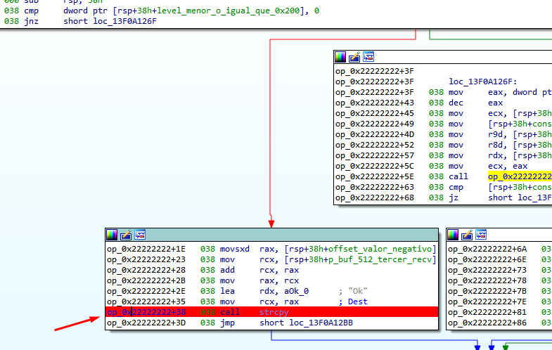

Я запустил скрипт и отправил программе пакет, которую мы сделали.

Как только скрипт достигнет уровня **0**, программа перейдет к **STRCPY** как мы видели, и остановится там. Затем программа выйдет из всех повторений, увеличивая уровень каждый раз, когда будет выход, пока не дойдет до первого повтора, равного уровню **0x200**. Здесь мы видим, что мы перезаписываем **CONST\_0** отцовскую функцию и переходим на **STRNCAT**.

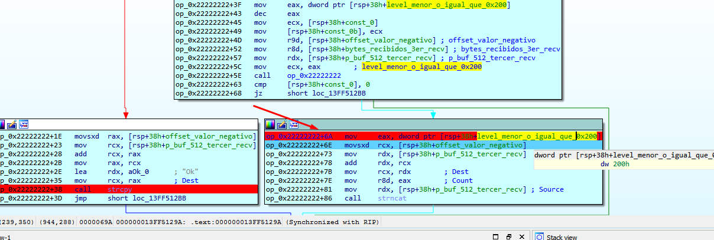

Программа скопирует **0x200** из **SOURCE**, что представляет собой буквы **A**, которые я отправил на 3-й **RECV**, и добавил его после **OK**, который является **DESTINATION**.

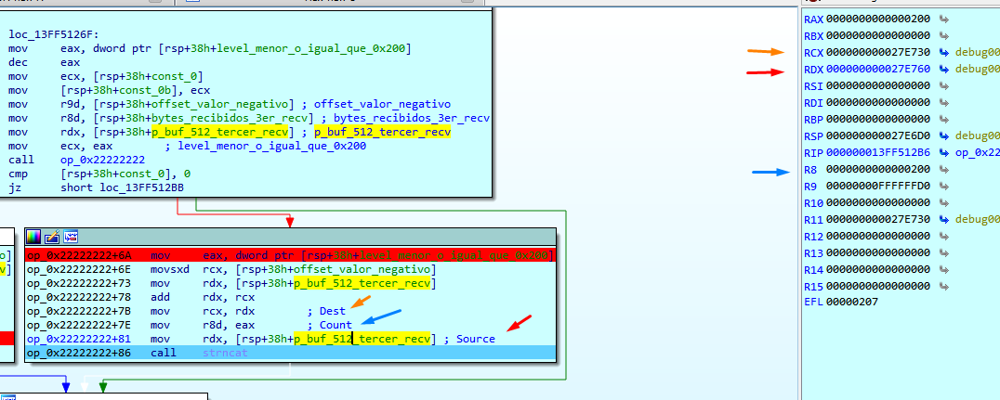

**SOURCE**

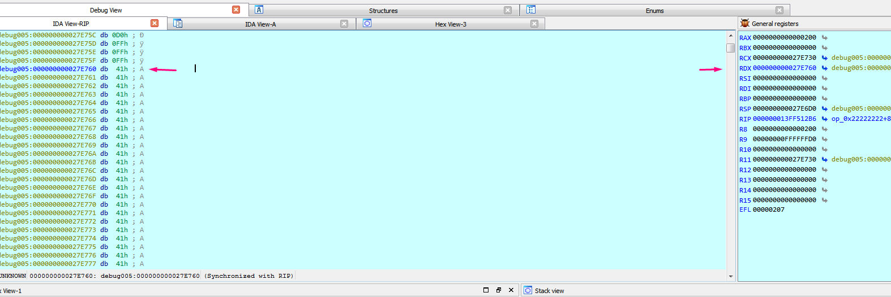

**DESTINATION**

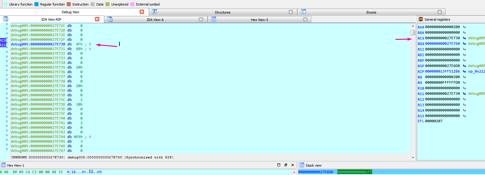

Хорошо. С этим мы уже знаем, что мы перезапишем размер **SEND**. Давайте продолжим трассировать до нужного места.

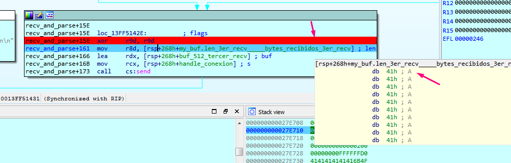

Я вижу, что размер того, что программа собирается отправить переписан моими символами **A**. Проблема в том, что программа будет зависать, так как она не может читать так много и будет ломаться при чтении. Проблема в том, что нужно увидеть, какое значение передать, чтобы прочитать **COOKIE**, обратный адрес и ничего не поломать.

Я останавливаю программу.

Напомним, что мне начинает отправляться с начала **BUFFER\_512\_TERCER\_RECV** сумма, которую я хочу.

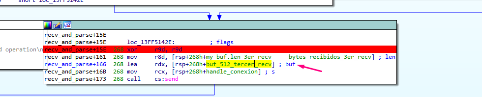

Возможное количество будет **544** байта от начала буфера, так как программа отправит мне **COOKIE** и адрес возврата. Так же, может быть передано более большее значение, но главное чтобы не сломает стек. То, что передает **LUCAS**, это значение **0x2FF**. Так как мы собираемся использовать его **ROP** давайте оценим это значение.

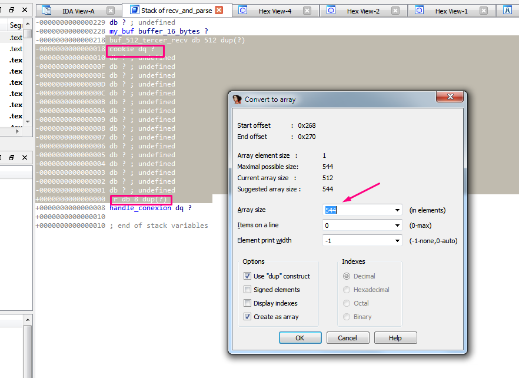

Как мы можем узнать какая из всех этих букв **A** это та которая перезаписывает размер?

Это нужная функция

```python
import random, string

def randomword(length):
letters = string.ascii_lowercase
return ''.join(random.choice(letters) for i in range(length))
```

Я её добавляю.

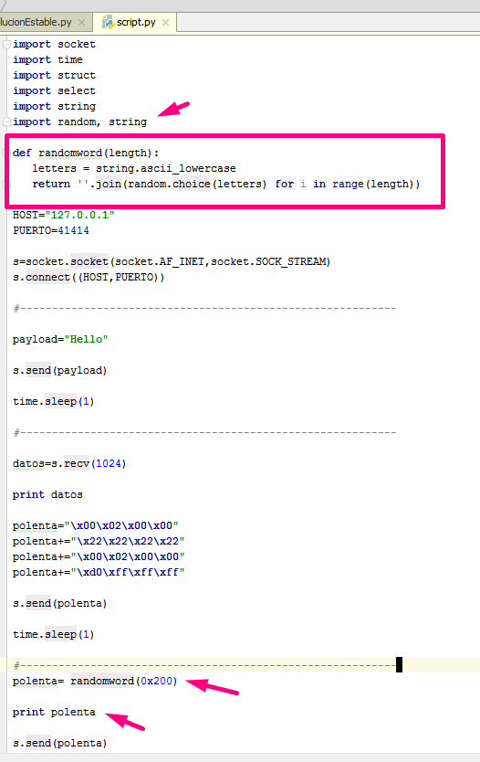

Чтобы прочитать размер **SEND** программа говорит какие символы попадают прямо здесь.

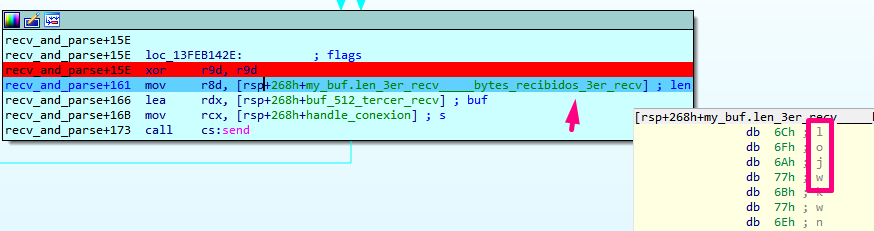

В моём случае это **LOJW**. Я ищу их в строке который распечатал скрипт.

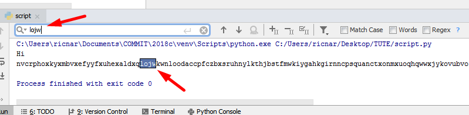

Я копирую строку и обращаю внимание на её длину.

```python
len("nvcrphoxkyxmbvxefyyfxuhexaldxq")
```

Она равна **30**.

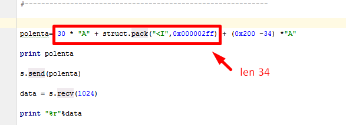

Поэтому я помещу **30** букв **A**, затем размер, который я хочу отправить. Я буду использовать тот же, который использовал **LUCAS 0x2FF**, а затем дополню **0x200** байтов пакета большим количеством букв **A**.

Давайте ещё раз запустим скрипт.

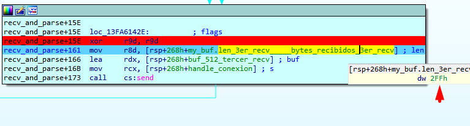

Мы видим, что размер подходит. Давайте дальше посмотрим, что мне вернется через **SEND**.

Мы видим, что после букв **A** добавляются символы.

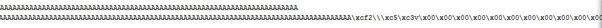

Напомним, что буфер был из **0x200** байт \(**512** десятичных\) поэтому сразу после этого идет **COOKIE**.

**print "%r"**%data\[512:512+8\]

Этим мы распечатаем значение **COOKIE**.

Я запускаю скрипт снова, и когда он останавливается на **SEND**, я обращаю внимание на значение **COOKIE**.

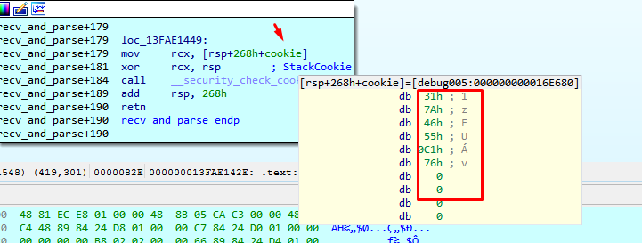

При этом запуске в этом снимке в моем случае это то, что мы увидим если я нажму **RUN**. Если я распечатаю в скрипте те же **COOKIE**.

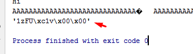

Это и есть те самые **COOKIE**.

Если я добавлю к коду

```python
import binascii
```

И использую это

```python
data = s.recv(1024)
cookie=data[512:512+8]
print "%r"%cookie
print binascii.hexlify(cookie)
```

И запускаю скрипт заново.

**COOKIE** покажутся в новом виде.

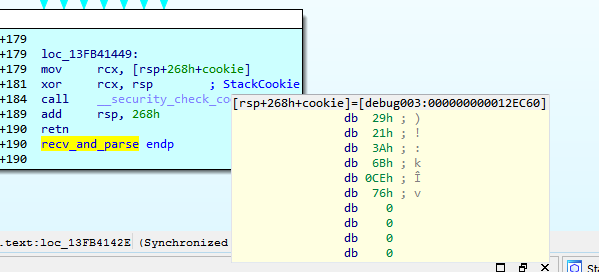

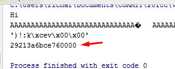

Я вижу, что совпадают значение. Если хочу распечатать с помощью **\X**.

Это никак не влияет, это необязательно, но я делю строку на два символа, а затем с помощью **JOIN** добавляю **\X** посередине и впереди.

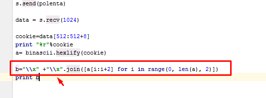

И заново запускаю скрипт, посмотреть что получилось.

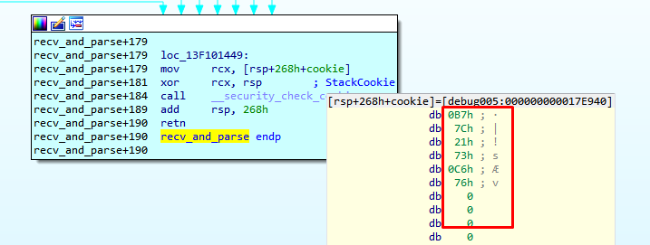

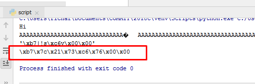

Уже лучше видно и у нас есть **COOKIE**.

Следующее значение которое нужно получить это адрес возврата.

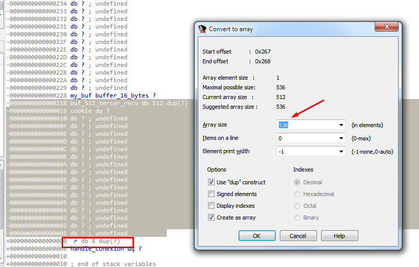

Он находится между **536** и **536+8**.
Для того, чтобы это всё выглядело красиво я определил функцию **MY\_PRINT**, чтобы распечатать на свой вкус наши значения.

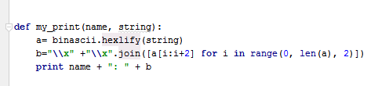

Когда программа достигает адреса возврата, я обращаю внимания куда она вернется. **ESP** будет указывать туда.

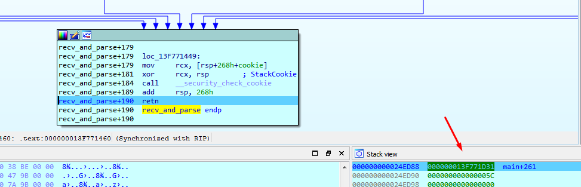

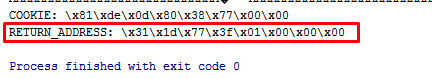

У нас уже есть два наиболее важных значения: **COOKIE** и место куда бы я хотел вернуться.

Очевидно, что при выходе из функции **RECV\_AND\_PARSE** программа бы вернулась туда, поэтому мы объединили этот адрес исполняемого файла.

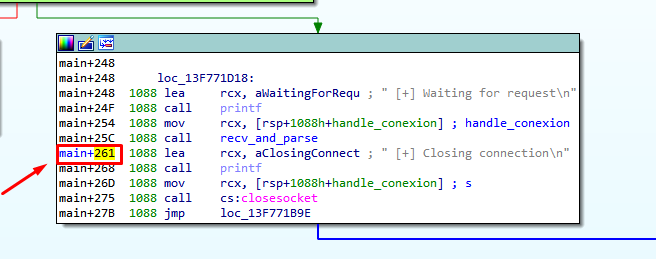

Если я трассирую с помощью **F7** отсюда.

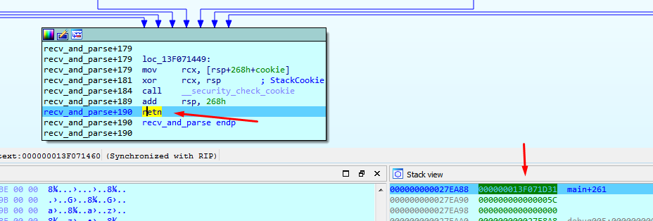

*## Нехватает огромного куска, часть 2. Возможно Яша переведет.*
