# Часть 8

Мы уже увидели в деле основные инструкции, сейчас давайте продолжим работу с **ЗАГРУЗЧИКОМ**.

Способ работать, когда мы не имеем много опыта по статическому реверсингу состоит в том, чтобы комментировать и переименовывать инструкции и области, чтобы иметь лучшую ориентацию по коду и этим мы делаем большую часть своей работы. По мере того, как Вы больше практикуетесь в статическом реверсинге, то можно добиться больше и больше успехов в реверсинге, даже почти без использования отладчика или, иногда, вообще без отладчика.

Обычно, существуют тяжеловесные программы, которые Вы не должны полностью реверсить, а только одну или несколько её функций, в некотором определённом месте.

**IDA** даёт нам возможность взаимодействовать с ней так, чтобы получить от неё лучшие результаты реверсинга, как никакой другой инструмент. Но эти результаты будут зависеть также и от опыта пользователя.

Знаменитая фраза звучит так - "Не стрела виновата, а лучник", здесь это правило применяется полностью, необходимо практиковаться и улучшать использование **IDA‘**ы, если мы даже потерпим неудачу или не получим хорошего результата, мы должны улучшать наш уровень и практиковаться больше и чаще, **IDA** — это не простой инструмент и он имеет тысячи и тысячи возможностей, что позволяет нам каждый день узнавать что-то новое про неё, когда мы используем её.

Давайте начнём изучать статический анализ на примере **КРЭКМИ CRUEHEAD**'а. Не важно, найдём ли мы решение сейчас или, если это необходимо, закончим его потом, когда мы дойдем до части про **ОТЛАДЧИК**. Важная вещь состоит в том, чтобы научиться работать с **ЗАГРУЗЧИКОМ** и улучшать наше с ним отношения по работе.

Если мы зайдём в пункт меню **VIEW-&gt;OPEN SUBVIEW-&gt;SEGMENTS** мы увидим сегменты, которые загружает **ЗАГРУЗЧИК** в автоматическом режиме.

Мы видим, что, например, **ЗАГОЛОВОК** по адресу **0x400000** перед секциями, не загружен, так как так настроено в настройках, когда он загружен в первый раз и мы нажимаем везде **OK,** он загружает только некоторые исполняемые секции автоматически без **ЗАГОЛОВКА**.

Мы видим, что после **ИМЕНИ** секций, у нас есть адреса их начала **START** и конца **END**, затем столбцы **RWX**, которые говорят мне имеют ли они первично разрешения чтения или **READ\(R\)**, записи или **WRITE\(W\)** и выполнения или **EXEC\(X\)**.

Затем, мы видим два столбца с именами **D** и **L**, которые соответствуют **ОТЛАДЧИКУ** и **ЗАГРУЗЧИКУ,** мы видим, что столбец **ОТЛАДЧИК** пустой, потому что он вызывается, когда мы загружаем программу в режиме **ОТЛАДЧИКА** и только тогда показывает загруженные сегменты в него, а **L** показывает, что загружает **ЗАГРУЗЧИК** и затем какие-то другие столбцы, которые не очень важны нам.

В этом случае не обязательно загружать заголовок, мы уже видели в предыдущей части, что когда мы переименовываем одну инструкцию и помещаем переход по адресу **0x400000**, **IDA** помечает её в красный цвет как адрес, который не загружен в **ЗАГРУЗЧИК**.

Если я хотел бы загрузить **ЗАГОЛОВОК** снова - я просто опять открываю **CRACKME.EXE**

Я говорю **IDA**’е затереть проект или **OVERWRITE** весь предыдущий анализ и делаю снова новый.

Я ставлю галочку напротив **MANUEL LOAD** и нажимаю **OK**.

**IDA** спрашивает у меня, хочу ли я изменить вручную **БАЗУ**, откуда будет загружен исполняемый файл и я нажимаю на **OK** соглашаясь со значением, которое она сама подставила.

А теперь меня спрашивают \(вручную и поодиночке\) какие сегменты я хочу загрузить, и я нажимаю везде **YES**.

Теперь у меня есть загруженные в **ЗАГРУЗЧИК** все секции, включая даже **ЗАГОЛОВОК** и теперь мы можем изменять больше **ДАННЫХ**.

Всё это, обычно, не нужно делать, но хорошо помнить про это.

Сейчас я буду сохранять **СНИМОК** с помощью пункта меню **FILE-&gt;TAKE DATABASE SNAPSHOT** и я буду изменять переход **JMP 0x400000** как ранее.

Мы видим, что уже адрес **0x400000** не отмечен в красный цвет и **IDA** говорит мне, что это **ImageBase**, мы можем даже пойти и посмотреть на него, просто кликнув по имени **ImageBase**.

Здесь мы видим заголовок по адресу **0x400000** с его тэгом **ImageBase** и содержимым, которое опознано как заголовок и **IDA** показывает нам его поля.

Хорошо, давайте вернёмся к предыдущему снимку, до того как мы всё изменили с помощью **VIEW-&gt;DATABASE SNAPSHOT MANAGER** и нажимаем там **RESTORE**.

Конечно, во всех упражнениях по отладке или ревериснгу строки играют ключевую роль, чтобы привести нас в важные области, если они существуют, они могут нам помочь, давайте посмотрим в меню **VIEW-&gt;OPEN SUBVIEW→STRING**, что же мы там видим ?

Сейчас, поскольку есть больше секций, то есть и больше обнаруженных строк, как и раньше, если мы запускаем **CRACKME.EXE** вне **IDA** мы видим, что в меню **HELP** есть пункт **REGISTER** и нас просят ввести **USER** и **PASS** и если мы вводим что-нибудь от себя, нам покажут сообщение **NO LUCK THERE**, **MATE!**.

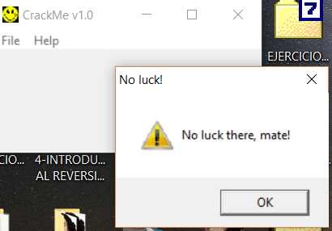

Мы ищем эту строку в списке **IDA**’ы.

Если мы сделаем двойной щелчок на этой строке.

Мы видим по адресу **0x402169** содержимое, которой является строка, мы знаем, что если мы нажмём **D** на этом адресе строка рассыпется на байты.

И если, мы нажмём **A** на адресе, то мы восстановим строку, а если нажмём **X,** то увидим две ссылки, которые **IDA** показывает в правой стороне более комфортно для нас.

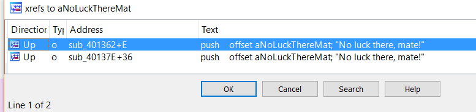

Мы видим, что из двух разных функций вызывается наша строка, одна вызывается из функции **sub\_401362,** а другая из функции **sub\_40137E** и оба выше адреса, где мы сейчас находимся. Вот почему в столбце **НАПРАВЛЕНИЕ**, **IDA** показывает **UP** в обоих случаях.

Мы знаем, что это две разные функции, потому что **IDA** показывает нам адреса ссылок как имя функции + **XXXX** и если они принадлежат только одной функции она должна изменить только **XXXX**, но сохранить первую часть, здесь оба **sub\_** различны - вот почему функции разные.

Это первая ссылка, а вторая находится ниже.

У нас есть области, где нам показывается плохое сообщение, когда мы вводим неправильные **USER** и **PASSWORD**, мы будем стараться пройти как можно дальше насколько это возможно без отладчика, если кто-то захочет увидеть и проверить эту часть в отладчике **OLLYDBG**, просто поместите **BP** на оба адреса и посмотрите, что произойдёт если мы введем данные, которые первоначально не правильные, сейчас для начала эта помощь полезна, но идея состоит в том, чтобы всё меньше и меньше пользоваться такой помощью, а больше работать с **IDA**, мы могли бы также поместить **BP** в оба блока в **IDA** и увидеть, что останов произойдёт также, но с использование I**DA DEBUGGER**, я думаю лучше оставить это на потом.

Давайте возьмем первую из двух ссылок.

Мы видим, что есть **CALL** к **API функции MessageBox,** которая показывает такие сообщения как **NO LUCK THERE MATE** и она получает строку **NO LUCK** как аргумент для заголовка окна и **NO LUCKTHERE MATE** как текст для окна.

Мы видим, что другая ссылка точна такая же, это означает, что плохое сообщение может быть показано с двух разных мест возможно сравнивая разные вещи, и чтобы показывать хорошее сообщение мы будем избегать их оба.

Если мы посмотрим ссылки на адрес **0x401362** с помощью **X**, мы увидим единственное место перед тем, как идти туда, давайте переименуем функцию по адресу **0x401362** на имя, которое сообщит нам, что она делает, например **CARTEL\_ERROR**.

Нажмём **N** на адресе и напишем наше новое имя.

Теперь если мы перейдем к ссылке.

Здесь мы видим блок, который приводит нас к **CARTEL\_ERROR** до принятия решения, которое принимается в программе, в первую очередь, так как, когда я буду делать реверсинг, я хочу видеть нужные мне вещи с помощью первого взгляда и сразу т. е. видеть блоки ошибок или плохие сообщения, для этого я закрашиваю их в красный цвет для подсветки.

Здесь есть иконка, с помощью которой можно изменить цвет, многие скажут, что это ненужная вещь, но в сложных функциях иметь подсвеченные блоки - очень важно.

И здесь у нас есть условный переход, который мы не будем анализировать сейчас, потому что он переходит в блок или в другой, но давайте посмотрим во внутрь блока по адресу **0x40124C**, войдём в этот **CALL** по адресу **0x40134D** с помощью **ENTER**.

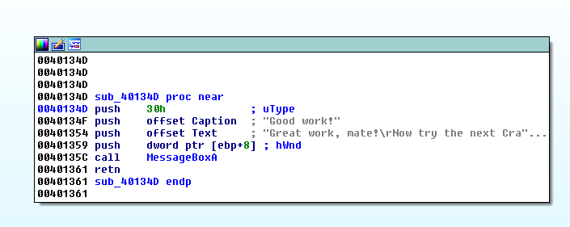

Здесь мы видим несколько возможных хороших строк, которые также были в списке строк, но так как сообщение об ошибке появлялось, это давало нам строку с ошибкой, мы подумали и решили, что лучше начинать анализ здесь, потому что это может быть ложная строка хорошего сообщения, но как мы видим, программа решает прийти сюда или в зону плохого сообщения, мы видим, что очень вероятно, что всё же это правильное решение.

Эту функцию мы переименуем в **CARTEL\_BUENO**.

И перекрасим блок, который приносит нас сюда, в салатовый цвет.

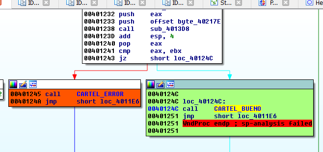

И также мы будем работать с другими частями программы, чтобы можно было легко возвращаться назад, мы находимся сейчас в **JZ** по адресу **0x401243** и идём в **JUMP-&gt;MARK POSITION** и вводим имя, которое вело бы нас к **DECISION\_FINAL**.

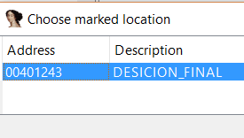

Мы видим, что в меню **JUMP-&gt;JUMP TO MARKED POSITION** появляется список со всеми нашими отметками, которые мы сделали раньше и мы можем перейти к любой из них, которая нам нужна, если мы теряемся в программе.

Это означает, что теоретически, если мы пропатчим этот **JZ** и изменим его на **JNZ** даже будучи неправильным он будет переносить наc всегда к **GOOD WORK**, и предыдущее сообщение об ошибке не появится перед нами, давайте посмотрим так ли это.

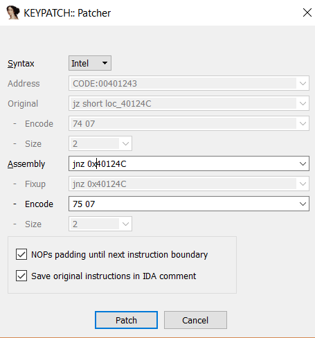

Я правлю переход с помощью **KEYPATCH**.

И сохраняю изменения с помощью **APPLY PATCH TO INPUT FILE**.

И мы видим, что мы пропатчили переход, но теперь в другом месте покажется другое сообщение об ошибке, которое мы не пропатчили.

Если мы введем такие данные, мы увидим, что выводятся два первых сообщения об ошибке, а затем хорошее, давайте посмотрим, сможет ли мы пропатчить другое сообщение об ошибке.

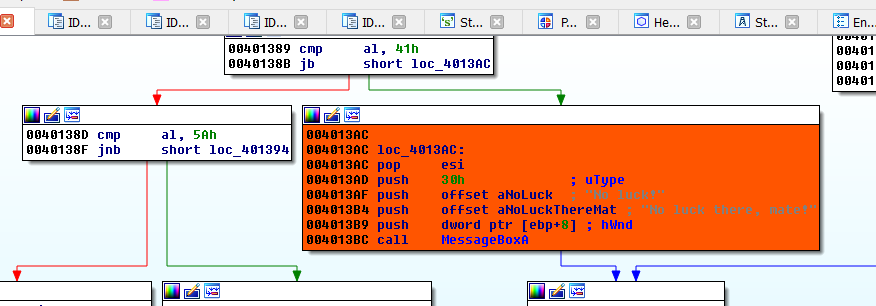

Если с помощью пробела мы выйдем из графического режима.

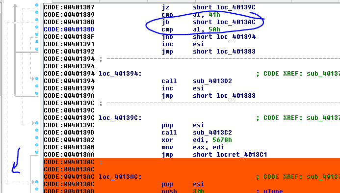

Мы видим, что **JB** будет совершать переход, который приведёт нас к сообщению об ошибке, пунктирная линия слева показывает мне переход, так что если я занопаю это место, программа не будет совершать переход и будет продолжена со следующей инструкции не приходя сюда.

Мы видим здесь другое сообщение об ошибке, которое я покрасил в оранжевый цвет, ниже мы проанализируем этот крэкми полностью, но сейчас очевидно, что здесь происходит сравнение с числом **41**, что есть буква **A** в **ASCII** коде и если введенное число ниже **41** \(**JB**\), то нам показывается сообщение об ошибке, так что мы видим, если в последней попытке ввести числа вместо букв в поле имени, становится очевидно, что числа ниже **41** \(**0** = **30**, **1** = **31**, **2** = **32**, и т.д.\) следовательно, когда крэкми обнаруживает, что в имени есть числа, то нам показывается сообщение об ошибке, так что давайте пропатчим это дело \(здесь мы не можем изменить **JB** на **JNB**, потому что если ..... невъехал  ****\).

Вернёмся назад в графический режим.

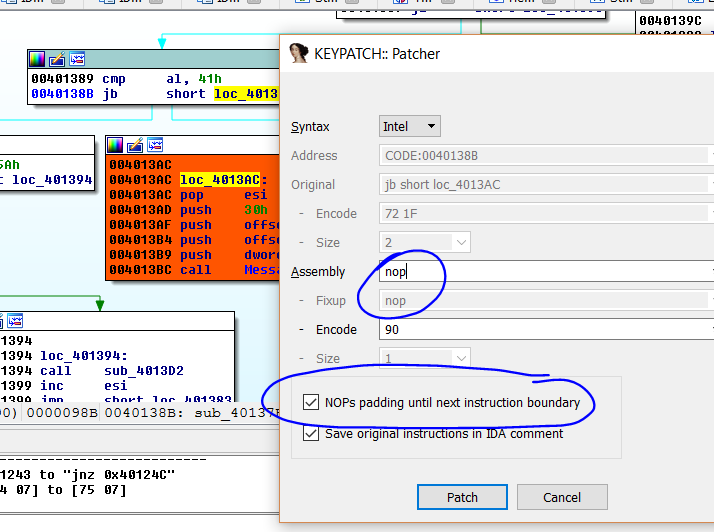

Мы видим, что будем заполнять наш код с помощью байта **0x90** до следующей инструкции, так что, надеюсь, программа не перестанет работать.

Всё хорошо, но блоки стали беспорядочными и смотрятся всё это уродливо, поэтому я делаю правой щелчок мышкой и выбираю **LAYOUT GRAPH** и теперь всё смотрится намного лучше.

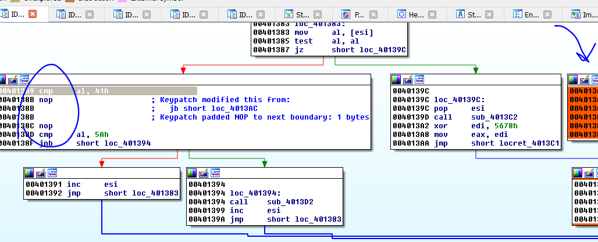

Мы видим, что здесь есть **NOP**'ы и блок ошибок остаётся изолированным и программа больше не может прийти туда.

Я сохраняю изменения таким же образом, как и раньше.

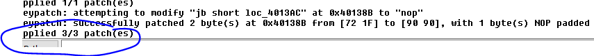

Мы видим, что сейчас принимаются любые данные.

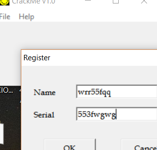

Хорошо, это только начало, очевидно, мы просто пропатчили крэкми, чтобы просто войти в контакт со статическим реверсингом и начать его понимать, далее мы увидим как отреверсить крэкми полностью и даже сделаем кейген для него, но это будет в других главах, сейчас же, мы идём медленно и мы это видим.

До встрече в **9**-ой главе.  
Рикардо Нарваха

